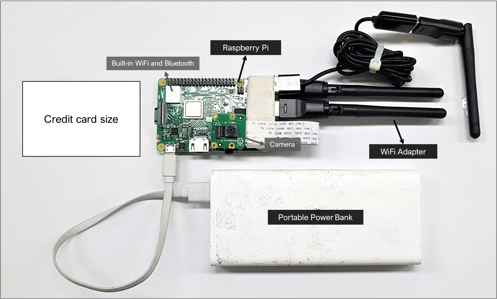
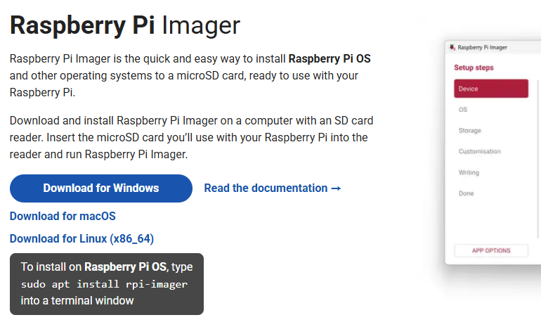
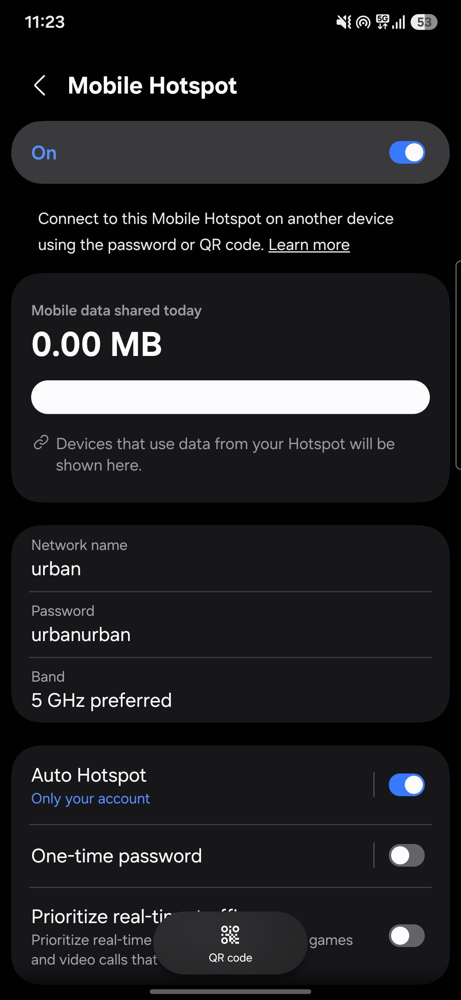
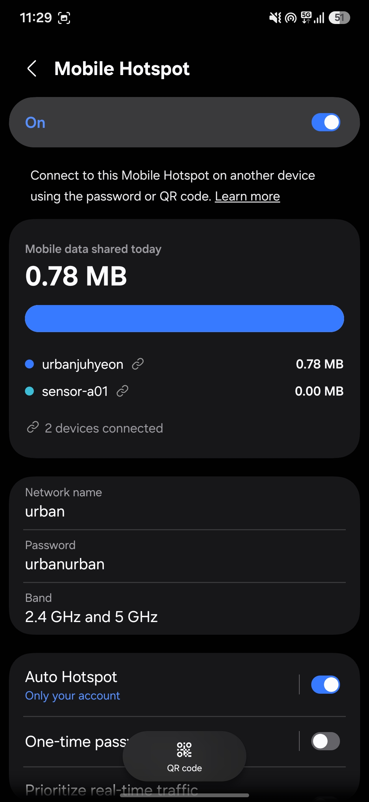
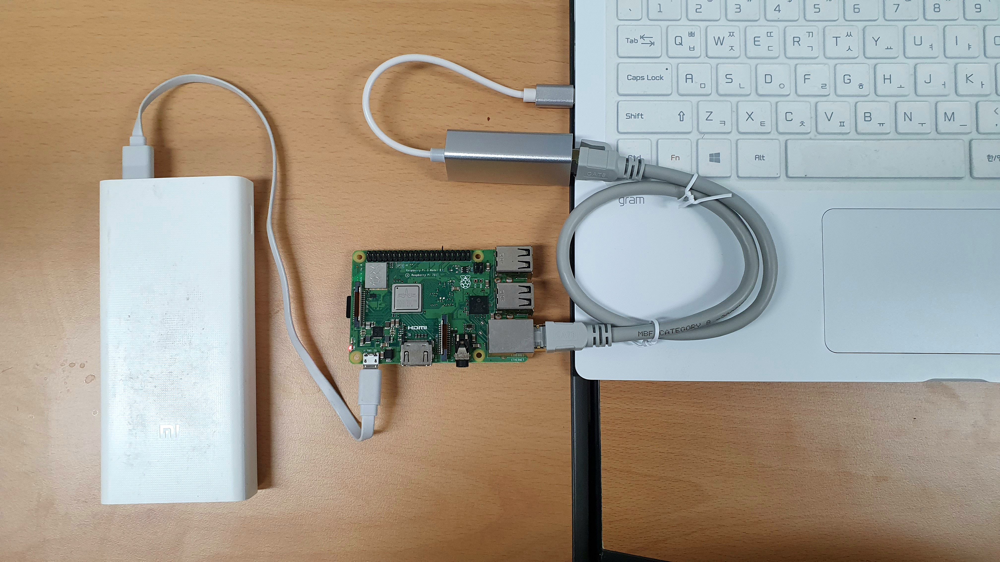
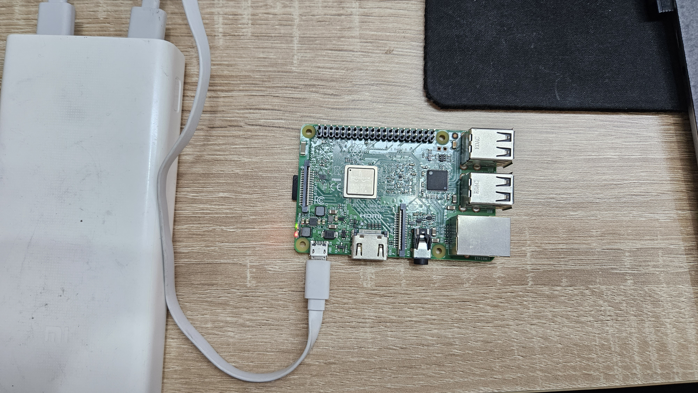
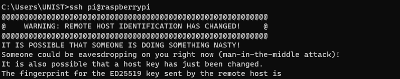
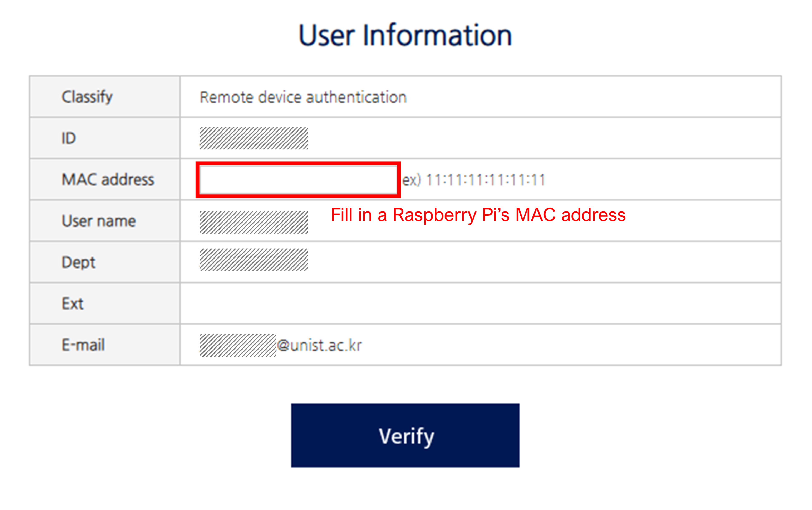

# Prepare the Raspberry Pi

This chapter prepares the hardware, operating system, and management connection
for a WiFi sensor. The complete
setup sequence was checked in July 2026 using Raspberry Pi Imager 2.0.10, a
Raspberry Pi 3, and Raspberry Pi OS Lite (32-bit), based on Debian Trixie. After
assembling the components, you will install the operating system and establish
remote access to the Pi via SSH. Imager labels may change slightly in later
releases, but the sequence remains Device, OS, Storage, Customisation, and
Writing. A troubleshooting section at the end covers common setup issues.

::: {.callout-tip title="Completion checkpoint"}
At the end of this chapter, Windows PowerShell reaches the prompt
`sensoradmin@sensor-a01:~ $` over SSH. No collector software is installed and
no sensing has started.
:::

::: {.callout-note title="Chapter 2 roadmap"}
Chapter 2 deliberately separates four different jobs:

1. **Prepare the Raspberry Pi**: write the OS and prove that SSH works.
2. **Install the Collector**: install and self-test the software without
   sensing.
3. **Configure the Experiment**: assign the experiment, sensor, shared HMAC
   key, and capture channels without sensing.
4. **Validate and Deploy**: perform a controlled capture, inspect the stored
   result, and only then enable automatic collection at boot.

Each chapter ends with a checkpoint. Do not skip ahead when a checkpoint does
not match the expected result.
:::

## Components

The WiFi sensor consists of a single-board computer, one or more wireless
adapters for packet capture, and supporting peripherals for power and storage:



The core components are:

- **Raspberry Pi**: A single-board computer, Model 3 or newer, that serves as the main computing unit.
- **Capture WiFi adapter(s)**: External USB adapters with monitor-mode and
  radiotap RSSI support. The checked three-channel arrangement uses three
  adapters, one each for channels 1, 6, and 11. A one-adapter experiment is
  supported, but it observes only its configured channel. The Pi's built-in
  WiFi is kept in managed mode for the hotspot and SSH connection in this
  walkthrough; it is not a capture adapter.
- **Micro SD card and reader**: Use at least 16 GB; 32 GB or more provides more
  room for field databases. The reader connects the card to the computer for
  imaging.
- **Model-appropriate power supply**: Use a stable supply that meets the Pi
  model's voltage and current requirement during setup, including the added USB
  adapters.
- **Portable power bank**: For field use, choose one whose output rating meets
  the same requirement. Capacity such as 20,000 mAh affects runtime; it does
  not by itself guarantee adequate power output.
- **Windows computer**: Used to run Imager, transfer the collector, and manage
  the headless Pi through PowerShell and SSH.
- **Optional Ethernet cable**: Retained only as a fallback management route;
  the current main walkthrough uses a mobile hotspot.

Additional sensors such as cameras or environmental monitors can be added for extended data collection.

::: {.callout-note collapse="true" title="Costs at the Time of the Original Deployments"}

All components are commodity electronics. A complete unit as deployed in the 2019--2020 field studies (@sec-deployment) cost roughly **USD 80--100** at the time: a Raspberry Pi Model 3 B+ (about USD 35--40) was the single largest item, the three RT5370 USB WiFi adapters added only a few dollars per set, and the rest went to a 32--64 GB micro SD card, a 20,000 mAh power bank, and casing and mounting materials. Prices vary by market and year, and any Pi Model 3 or newer works as long as the selected adapter's monitor mode and radiotap RSSI support are confirmed through the controlled hardware test in the Deployment chapter.

Off-the-shelf counting options sit in a much higher range. Dedicated lidar counters cost several thousand dollars per unit: the SICK MRS1000 scanner, for instance, was listed by industrial distributors at roughly USD 4,900--5,700 as of 2026.[^lidar-price] Stereo-vision people counters such as the Xovis PC2 series retail at roughly EUR 1,300--1,800 per sensor, usually alongside a separate software license,[^stereo-price] and simpler infrared beam counters run EUR 90--500 per unit. Turnkey WiFi-analytics services, which most closely resemble what this toolkit does, are typically sold as ongoing subscriptions rather than one-off purchases: one 2024 evaluation reported about 885 SEK, roughly **EUR 75 per measuring point per day**, for such a service [@mandalHowUsefulAre2024].

The comparison is not that the do-it-yourself sensor is strictly better. The commercial options provide turnkey deployment, vendor support, and validated accuracy out of the box, which a self-built sensor does not. What the toolkit offers in exchange is a low hardware cost, direct access to the collected observation data, and the freedom to inspect and modify every step of the processing, which suits research use where transparency and adaptability matter more than plug-and-play convenience.

[^lidar-price]: Figure from industrial distributor listings (Motion World; RS Components), retrieved July 2026. Prices for surveying-grade sensors change frequently and larger configurations are often quoted only on request, so treat this as an order-of-magnitude reference rather than a fixed price.

[^stereo-price]: Authorized-distributor listing (Vemco Group) for the Xovis PC2SE line, retrieved July 2026. Enterprise counters are often sold through integrator quotes rather than fixed public prices, so treat this as indicative.

:::

## Operating System

### Download the Pi Imager

Download the latest stable Raspberry Pi Imager from the [official
website](https://www.raspberrypi.com/software/) and install it on your
computer. On first launch, choose the language used for the Imager interface.
This choice does not determine the Pi's time zone, keyboard, or WiFi regulatory
domain; those are configured separately under **Localisation**.

The current headless options and their meanings are also documented in
Raspberry Pi's [official installation
guide](https://www.raspberrypi.com/documentation/computers/getting-started.html).

{#fig-imager-download}

::: {.callout-tip collapse="true"}
## Garbled button labels on Windows

Raspberry Pi Imager 2.0.10 can render button labels incorrectly on some
Windows systems. Close Imager, press `Win + R`, and launch it with the Windows
GDI font engine:

```text
"C:\Program Files\Raspberry Pi Ltd\Imager\rpi-imager.exe" -platform windows:fontengine=gdi
```
:::

### Flash the OS

Insert the micro SD card and follow the Imager steps in order. A separate erase
or formatting step is not required: Imager erases the selected storage device
when it writes the operating system.

The following walkthrough shows the complete sequence used for the checked Pi 3
setup, from device selection through the start of writing. The username and
hotspot credentials visible in the recording are example values.

The walkthrough uses these values consistently:

| Setting | Walkthrough value |
|---|---|
| Device | Raspberry Pi 3 |
| OS | Raspberry Pi OS Lite (32-bit) |
| Hostname | `sensor-a01` |
| Time zone | `Asia/Seoul` |
| Keyboard | `kr` |
| Username | `sensoradmin` |
| Password | `sensoradmin` (example) |
| Wi-Fi name | `urban` (example hotspot) |
| Wi-Fi password | `urbanurban` (example) |
| SSH | Enabled with password authentication |
| Raspberry Pi Connect | Not enabled |

Readers should replace the example credentials and sensor identifier with the
values selected for their own deployment, then use them consistently in later
commands.


#### Step-by-step settings

The recording uses the following choices:

1. **Device**: Select the Raspberry Pi model you have. The checked walkthrough
   uses **Raspberry Pi 3**.
2. **OS**: For the Pi 3 walkthrough, select **Raspberry Pi OS Lite (32-bit)**.
   The Lite edition is appropriate for a headless sensor because it does not
   install a graphical desktop. Pi 4 and Pi 5 users may select the corresponding
   Lite 64-bit image.
3. **Storage**: Select the micro SD card. Confirm its capacity carefully and
   leave **Exclude system drives** selected so that the computer's internal
   drive cannot be chosen accidentally.
4. **Hostname**: Assign an opaque, unique hostname. This walkthrough uses
   `sensor-a01`. Use letters, numbers, and hyphens only.
5. **Localisation**: Select the nearest capital city and confirm the suggested
   time zone and keyboard layout. For the checked Korean setup, these were
   `Seoul (South Korea)`, `Asia/Seoul`, and `kr`.
6. **User**: Create the ordinary administrator account used for SSH. The
   example uses `sensoradmin` for both the username and password. Later commands
   use this example username consistently.
7. **Wi-Fi**: Select **Secure network** and enter the mobile hotspot's SSID and
   password. The example uses `urban` and `urbanurban`. Enable **Hidden SSID**
   only when the hotspot is actually configured not to broadcast its name.
8. **Remote access**: Turn on **Enable SSH**. This walkthrough uses **Use
   password authentication**; public-key authentication is also supported for
   readers who already manage SSH keys.
9. **Raspberry Pi Connect**: Skip this optional account-based service. It is not
   required by the collector or by the SSH route in this book.
10. **Writing**: Review the summary. Confirm that the device, OS, storage,
    hostname, localisation, user account, WiFi, and SSH choices are correct;
    then select **Write**. Allow Imager to finish both writing and verification
    before removing the card.

Once complete, insert the SD card into the powered-off Pi. The external capture
adapters are not needed for this first boot; Chapter 2.3 introduces them after
SSH and the collector installation have been checked. Then connect power to
boot.

::: {.callout-note collapse=true}
## Why use a mobile hotspot?

The sensor needs a network connection at boot to obtain accurate time and to
support SSH access during setup. A mobile hotspot provides the same predictable
network at a desk and in the field, without depending on a captive portal or an
institutional network.

The walkthrough uses example hotspot values. Substitute the network name and
password of the hotspot that the Pi will actually use.
:::

## Remote Access

The current setup uses the mobile hotspot configured in Imager. The phone, the
computer used for SSH, and the Pi must all be on that same hotspot.

### 1. Prepare the mobile hotspot

Turn on the phone's mobile hotspot and use the same network name and password
entered in Imager. The screenshots below use the example values `urban` and
`urbanurban`.

For a Raspberry Pi 3, make sure the hotspot offers **2.4 GHz**. In the example
below, the initial **5 GHz preferred** setting prevented the Pi from joining;
changing **Band** to **2.4 GHz and 5 GHz** restored compatibility. Menu labels
vary by phone.

{#fig-hotspot-band fig-align="center" width="46%"}

### 2. Boot the Pi and confirm the connection

Insert the flashed micro SD card, connect power, and allow several minutes for
the first boot. Connect the computer to the same hotspot. Before attempting
SSH, check the hotspot's connected-device list: it should show both the
computer and the Pi's hostname, such as `sensor-a01`.

{#fig-hotspot-connected fig-align="center" width="46%"}

### 3. Connect from PowerShell with SSH

The following recording shows the first SSH login and the checks used in the
July 2026 walkthrough.


Open PowerShell on the computer and connect using the username and hostname
assigned in Imager:

```powershell
ssh sensoradmin@sensor-a01.local
```

On the first connection, enter `yes` to accept the host key, then enter the
account password. The password does not display while it is being typed. When
the prompt changes to `sensoradmin@sensor-a01:~ $`, complete the following
checks one at a time.

#### Confirm which Pi you reached

```bash
hostname
```

The output should match the hostname assigned in Imager; this walkthrough
reports `sensor-a01`.

#### Check the time zone and synchronization

```bash
timedatectl
```

Find `Time zone: Asia/Seoul` and `System clock synchronized: yes` in the
output. Readers in another location should see the time zone selected in
Imager.

#### Check the current local time

```bash
date
```

Confirm that the displayed date and time are current. A substantially wrong
clock should be corrected before installing or collecting data.

#### Check internet and DNS connectivity

```bash
ping -c 4 www.raspberrypi.com
```

A successful check resolves `www.raspberrypi.com` and ends with received
packets and `0% packet loss` on the checked hotspot.

#### Return to Windows PowerShell

```bash
exit
```

The SSH session closes and the prompt returns to `PS C:\Users\...>` on the
computer. This confirms that the complete remote-access loop works before the
collector is installed.

If `<hostname>.local` cannot be resolved but the Pi appears in the hotspot's
device list, open the device entry to find its IP address and connect directly:

```powershell
ssh sensoradmin@<ip-address>
```

Raspberry Pi's [official remote-access
guide](https://www.raspberrypi.com/documentation/computers/remote-access.html)
documents the same `.local`, IP-address, SSH, and SCP routes.

::: {.callout-note collapse="true"}
## Legacy / alternative setup: Ethernet and Internet Connection Sharing

Earlier versions of this guide presented Ethernet and mobile hotspot access as
parallel setup options. The mobile-hotspot workflow above is the current main
route. The older Ethernet route is retained here for a computer without WiFi or
for a network on which the hotspot workflow cannot be used.

{width="85%"}

#### Ethernet cable

Connect the Pi to the computer using an Ethernet cable.



In Windows network settings, enable **Internet Connection Sharing** for the
Ethernet adapter. After the Pi has booted, open PowerShell or Command Prompt and
connect with:

```powershell
ssh <username>@<hostname>.local
```

#### Earlier mobile-hotspot illustration

The earlier guide used the following generic illustration. Its underlying
requirement is unchanged: the Pi and the computer must be connected to the same
hotspot before SSH can work.


:::

## Troubleshooting

Use the error shown in PowerShell to choose the relevant check below.

### `Could not resolve hostname`

This message occurs before password authentication: the computer cannot
translate `<hostname>.local` into the Pi's IP address.

1. Open the hotspot's connected-device list and look for the hostname assigned
   in Imager, such as `sensor-a01`.
2. If the Pi is absent, confirm that the hotspot name and password match the
   values entered in Imager. For a Raspberry Pi 3, also confirm that the hotspot
   offers 2.4 GHz.
3. Allow several minutes for the first boot, then refresh the device list.
4. If the Pi is listed but the `.local` name still fails, open its hotspot entry
   to find its IP address and connect directly:

```powershell
ssh sensoradmin@<ip-address>
```

### `Connection timed out` or `Connection refused`

These messages mean that an address was found but SSH did not answer. Confirm
that the Pi has power, the micro SD card is inserted, and the first boot has
finished. Also confirm that **Enable SSH** was selected in Imager. If an IP
address was entered manually, recheck it in the hotspot's current device list
because hotspot addresses can change after reconnection.

### SSH host key warning

After the OS is rewritten, the Pi can present a new SSH host key while the
computer still remembers the old one. PowerShell then displays `REMOTE HOST
IDENTIFICATION HAS CHANGED`:



Remove only the stored key for that hostname and reconnect:

```powershell
ssh-keygen -R sensor-a01.local
ssh sensoradmin@sensor-a01.local
```

Review the new fingerprint, enter `yes`, and then enter the account password.

### Incorrect time or no internet access

After logging in, inspect time synchronization and test both DNS and internet
connectivity:

```bash
timedatectl
ping -c 4 www.raspberrypi.com
```

For the checked Korean setup, `timedatectl` should report `Asia/Seoul` and,
after synchronization, `System clock synchronized: yes`. If the ping fails,
confirm that the phone itself has mobile-data access and that the Pi remains in
the hotspot's connected-device list.

### University or corporate networks

Institutional networks can require device registration, a browser-based captive
portal, or isolation between connected devices. These controls can prevent SSH
even when both devices appear connected. Use the mobile-hotspot workflow for
initial setup and field operation; if the institutional network is required,
ask its administrator about device registration and peer-to-peer access.

{width=500}
