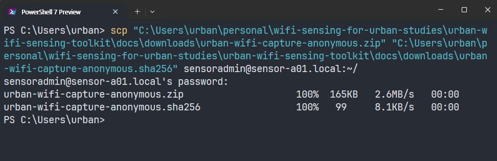

# Install the Collector

This chapter installs the maintained WiFi collector on the Raspberry Pi. It
does not yet name an experiment, create a deployment key, open a monitor
interface, or collect data. Keeping installation separate from study-specific
configuration makes it easier to tell whether a problem belongs to the
software or to a particular deployment.

::: {.callout-tip title="Completion checkpoint"}
At the end of this chapter, the Pi reports collector version `1.2.9` and
`self-test: PASS`. Both sensing services remain disabled and inactive.
:::

## Before You Begin

Allow approximately 15--30 minutes, mostly for operating-system updates and
Python package installation. Keep the Pi powered and connected to the hotspot.
Only the management connection prepared in the previous chapter is required;
the external capture adapters are not used until experiment configuration.

You will move between two prompts:

```text
PS C:\Users\...>                 Windows PowerShell
sensoradmin@sensor-a01:~ $      Raspberry Pi over SSH
```

Do not close a terminal merely because package output pauses for a few
minutes. Continue only after the command finishes and its prompt returns.

## Update Raspberry Pi OS

The recording below shows the July 2026 update and reboot sequence.


From the SSH prompt on the Pi, refresh the package index and install available
operating-system updates:

```bash
sudo apt update && sudo apt full-upgrade -y
sudo reboot
```

The `&&` prevents the upgrade from starting when the package index fails. If
APT reports an error, leave the Pi running and use the mirror troubleshooting
note below; do not reboot until both update stages finish successfully. After
`sudo reboot`, the SSH connection closes. Wait one or two minutes, then
reconnect from **Windows PowerShell**:

```powershell
ssh sensoradmin@sensor-a01.local
```

Remain signed in as `sensoradmin`; use `sudo` only where shown below.

::: {.callout-note collapse="true" title="Copy and paste in the terminal"}
Click the copy icon next to a code block. If `Ctrl+V` does not work in the
terminal, try `Ctrl+Shift+V` or right-click.
:::

## Transfer the Collector Package

The downloadable package is a fixed, text-only collector snapshot. It contains
no deployment key, database, packet capture, or credential.

- [Collector ZIP](downloads/urban-wifi-capture-anonymous.zip)
- [SHA-256 checksum](downloads/urban-wifi-capture-anonymous.sha256)

::: {.callout-important title="Check which computer the prompt belongs to"}
Commands containing a Windows path run in **Windows PowerShell**, outside SSH.

- `PS C:\Users\...>`: the Windows computer
- `sensoradmin@sensor-a01:~ $`: the Raspberry Pi over SSH
- `root@sensor-a01:...#`: an interactive root shell

Read the prompt before pasting each command.
:::

### Download both files on Windows

Click both links above and save the files in the same folder. The example below
uses the Windows `Downloads` folder. Open PowerShell and confirm that both
filenames are present:

```powershell
cd "$HOME\Downloads"
Get-ChildItem urban-wifi-capture-anonymous*
```

Do not continue until both the `.zip` and `.sha256` files are listed.

### Leave SSH before running scp

If an SSH session is open, return to Windows first:

```bash
exit
```

The prompt must now begin with `PS`. From the folder containing both downloaded
files, copy them to the Pi:

```powershell
scp .\urban-wifi-capture-anonymous.zip `
  .\urban-wifi-capture-anonymous.sha256 `
  sensoradmin@sensor-a01.local:~/
```

Both files should reach `100%` before the PowerShell prompt returns.

{#fig-scp-collector-transfer}

### Reconnect and verify the transferred ZIP

Reconnect to the Pi from Windows PowerShell:

```powershell
ssh sensoradmin@sensor-a01.local
```

Verify the download before extracting it:


This is a first-time installation path. If `~/capture-scripts` already exists
from a previous attempt, move that directory aside before extracting rather
than mixing two package versions in one source directory. Any deployment key or
configuration from a previous installation lives under `/etc/urban-sensing`,
not inside this extracted folder, so moving the folder aside is safe.

```bash
sha256sum -c urban-wifi-capture-anonymous.sha256
sudo apt install -y unzip
unzip -oq urban-wifi-capture-anonymous.zip
cd ~/capture-scripts
pwd
```

The checksum must report `urban-wifi-capture-anonymous.zip: OK`, and `pwd`
must report `/home/sensoradmin/capture-scripts`. Stop if the checksum does not
report `OK`; do not install an unverified archive.

## Install and Test

The following recording shows the package installation workflow as captured
with version 1.2.7. The current download is version 1.2.9, which uses the same
installation steps and adds a corrected graceful shutdown path for systemd.
The clip ends when the installer returns to the prompt; the current 1.2.9
checkpoint is shown separately below. The recording is silent; use the controls
to pause or skip through package installation.


Run the reviewed installer from `~/capture-scripts`:

```bash
sudo bash install.sh
```

Enter the `sensoradmin` password if prompted. Dependency installation and
wheel compilation can take several minutes. Wait for the prompt to return. A
successful run ends with:

```text
Installation complete. Capture was NOT enabled or started.
```

The installer creates a root-owned runtime in `/opt/urban-sensing`, the
non-login `urban-sensing` service account, a protected data directory, and two
restricted systemd unit files. It does not create a deployment key or start
collection.

Confirm the installed version and run the hardware-independent privacy test.
The self-test uses a synthetic source address and a temporary SQLite database;
it does not open a WiFi adapter or observe nearby traffic:


```bash
sudo -u urban-sensing /opt/urban-sensing/venv/bin/python -c \
  'from importlib.metadata import version; print("Version:", version("urban-wifi-capture"))'
sudo -u urban-sensing /opt/urban-sensing/venv/bin/urban-wifi-capture self-test
```

Expected output:

```text
Version: 1.2.9
self-test: PASS
```

Finally, verify that installation did not begin sensing:

```bash
sudo systemctl is-enabled urban-wifi-interfaces.service urban-wifi-capture.service
sudo systemctl is-active urban-wifi-interfaces.service urban-wifi-capture.service
```

Both services should report `disabled` and `inactive`. Stop here if the
version or self-test differs.

The complete expected state output is:

```text
disabled
disabled
inactive
inactive
```

The first two lines mean that sensing will not start automatically at boot.
The last two lines mean that neither service is running now.

::: {.callout-tip collapse="true" title="If APT repeatedly fails on one Raspbian mirror"}
`Failed to fetch` followed by an unreachable mirror name is a package-mirror
problem, not a collector error. During the July 2026 walkthrough, one package
was repeatedly redirected to an unreachable mirror. Back up the source file
outside APT's source directory and select the working example mirror:

```bash
cp /etc/apt/sources.list.d/raspbian.sources \
  "$HOME/raspbian.sources.backup"
sudo sed -i \
  's|http://raspbian.raspberrypi.com/raspbian|http://mirror.ossplanet.net/raspbian/raspbian|g' \
  /etc/apt/sources.list.d/raspbian.sources
sudo apt-get clean
sudo apt-get update
cd ~/capture-scripts
sudo bash install.sh
```

If this example mirror is unavailable at a later date or location, use a
current entry from the [official Raspbian mirror
list](https://www.raspbian.org/RaspbianMirrors). Do not paste an unverified
third-party repository into APT merely to bypass a transient outage.
:::

::: {.callout-note collapse="true" title="Why Samba and Dropbox are not installed"}
The earlier workflow used Samba for manual file transfer and Dropbox for a
small remote status signal. Neither is required by the maintained collector:
SSH/SCP handles installation files, and deployment status is checked through
systemd and its journal. The collector never synchronizes its key,
configuration, or database to cloud storage. Historical instructions can be
kept separately as legacy notes, but they are not part of the first-time path.
:::

The next chapter assigns this installed software to one experiment and one
sensor.
