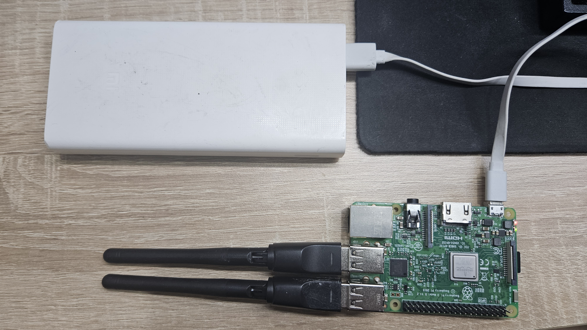

# Validate and Deploy

This chapter moves from a valid configuration to an operating sensor. First,
the Pi performs a short controlled capture. Only after the resulting database
passes its checks are the services enabled at boot and tested with field
power.

::: {.callout-important title="Use an authorized controlled setting"}
The radio-level demonstration can display nearby device addresses. Perform it
with approved test devices and according to the study's ethics, site, and data
security approvals. Do not publish identifiers belonging to bystanders.
:::

## Before You Begin

Continue only after Chapter 2.3 reports `configuration: VALID` and one
`planned` line per configured channel. Attach every external capture adapter,
turn on the approved management hotspot, and keep the laptop on that same
network. At this point both sensing services should still be disabled and
inactive:

```bash
systemctl is-enabled urban-wifi-interfaces.service urban-wifi-capture.service
systemctl is-active urban-wifi-interfaces.service urban-wifi-capture.service
```

The expected four lines are `disabled`, `disabled`, `inactive`, and `inactive`.
If the units are already enabled or active on a first-time walkthrough, stop
and determine why before beginning the controlled test.

## Controlled Hardware Test

Keep the configured external WiFi adapters connected and reboot the Pi. The
services are still disabled, so rebooting does not start collection.

```bash
sudo reboot
```

Wait one or two minutes and reconnect from Windows PowerShell:

```powershell
ssh sensoradmin@sensor-a01.local
```

### Confirm the plan after reboot

Verify synchronized time, the wireless default route, and the planned capture
mapping:


```bash
timedatectl show -p NTPSynchronized --value
ip -j route show default
sudo -u urban-sensing /opt/urban-sensing/venv/bin/urban-wifi-capture interfaces plan \
  --config /etc/urban-sensing/config.json
```

Time should report `yes`, and the plan should list one entry for each
configured channel.

### Create the monitor interfaces

Start only the interface-preparation service:

```bash
sudo systemctl start urban-wifi-interfaces.service
sudo -u urban-sensing /opt/urban-sensing/venv/bin/urban-wifi-capture interfaces status \
  --config /etc/urban-sensing/config.json
```

The status must contain one `present` line for every `planned` line. For a
three-channel setup it has this form:

```text
ucap0: present (physical=<first planned interface>, channel=1)
ucap1: present (physical=<second planned interface>, channel=6)
ucap2: present (physical=<third planned interface>, channel=11)
```

This is the first point where `present` is expected. The management interface
carrying the default route remains connected. The physical `wlan` numbers must
match the immediately preceding plan; they are not expected to match a prior
boot or another Pi.

### Show the radio boundary with tcpdump

Install the conventional diagnostic tool, then display 20 frames from one
monitor interface:


```bash
sudo apt install -y tcpdump
sudo tcpdump -i ucap0 -e -n -c 20
```

`tcpdump` reads the raw monitor interface directly, so source, destination, or
BSSID MAC addresses may appear. This is intentionally different from the
maintained collector. It demonstrates what exists at the radio boundary, not
what the research database retains. The recording above was made with the
walkthrough author's own devices in a controlled setup; do not treat its
visible addresses as research data.

### Run the maintained collector

Start the collector and confirm that it remains active:


```bash
sudo systemctl start urban-wifi-capture.service
sudo systemctl status --no-pager urban-wifi-capture.service
```

After a few seconds, select this run's database and watch only its increasing
record count. `Ctrl+C` closes this display without stopping the collector;
leave it after about ten seconds and allow the controlled run to continue for
a total of approximately two minutes.

```bash
sleep 2
DB="$(sudo find /var/lib/urban-sensing/data -maxdepth 1 -type f \
  -name 'raw_wifi_*.sqlite3' -printf '%T@ %p\n' | sort -nr | head -n 1 | cut -d' ' -f2-)"
test -n "${DB}"
watch -n 1 "sudo -u urban-sensing sqlite3 '${DB}' \
  'SELECT count(*) AS pseudonymized_records FROM packets;'"
```

The collector briefly reads a source address in process memory to calculate
its HMAC pseudonym. It does not write or print the raw address.

### Stop before inspecting the database

```bash
sudo systemctl stop urban-wifi-capture.service
sudo systemctl stop urban-wifi-interfaces.service
sudo journalctl -u urban-wifi-capture.service --since "5 minutes ago" --no-pager
```

The live row-count query above is deliberately limited to a health signal. Do
not copy the database or run schema, integrity, metadata, or row-level
inspection while the collector is writing. Perform the checks below only after
both services have stopped and the prompt has returned.

## Verify the Stored Data

The recording below selects the newest database created by the version 1.2.9
shutdown path, confirms SQLite integrity, displays five stored
32-character HMAC pseudonyms, and returns zero malformed rows.


Select the newest stopped database again so this section also works after a
new SSH login:

```bash
DB="$(sudo find /var/lib/urban-sensing/data -maxdepth 1 -type f \
  -name 'raw_wifi_*.sqlite3' -printf '%T@ %p\n' | sort -nr | head -n 1 | cut -d' ' -f2-)"
test -n "${DB}"
sudo stat -c '%a %U:%G %n' "${DB}"
```

Checkpoint the database and check its integrity:

```bash
sudo -u urban-sensing sqlite3 "${DB}" 'PRAGMA wal_checkpoint(TRUNCATE);'
sudo -u urban-sensing sqlite3 "${DB}" 'PRAGMA integrity_check;'
sudo -u urban-sensing sqlite3 "${DB}" 'PRAGMA table_info(packets);'
```

Show a few stored identifiers. Each value must be 32 lowercase hexadecimal
characters rather than a colon-separated raw MAC address:

```bash
sudo -u urban-sensing sqlite3 -header -column "${DB}" \
  'SELECT source_address AS hmac_pseudonym,
          length(source_address) AS characters
   FROM packets LIMIT 5;'
```

The final recording verifies the privacy metadata, the completed summary for
all three configured channels, zero reported loss, and exact agreement between
stored packet rows and records emitted by the capture workers.


Check the privacy metadata and reject malformed rows:

```bash
sudo -u urban-sensing sqlite3 "${DB}" \
  'SELECT key,value FROM capture_metadata ORDER BY key;'
sudo -u urban-sensing sqlite3 "${DB}" \
  "SELECT count(*) AS invalid_rows FROM packets
   WHERE length(source_address) <> 32
      OR source_address <> lower(source_address)
      OR source_address GLOB '*[^0-9a-f]*'
      OR source_address_randomized NOT IN (0,1);"
```

Finally, inspect the result for every channel:

```bash
sudo -u urban-sensing sqlite3 -header -column "${DB}" \
  'SELECT interface,channel,pcap_received,pcap_dropped,interface_dropped,
          queue_dropped,records_emitted,records_filtered,completed_at
   FROM capture_interface_summary ORDER BY channel,interface;'
```

Confirm that the stored row count equals the sum emitted by the workers:

```bash
sudo -u urban-sensing sqlite3 -header -column "${DB}" \
  'SELECT (SELECT count(*) FROM packets) AS packet_rows,
          (SELECT coalesce(sum(records_emitted),0)
             FROM capture_interface_summary) AS emitted_rows,
          (SELECT count(*) FROM packets) =
          (SELECT coalesce(sum(records_emitted),0)
             FROM capture_interface_summary) AS rows_match;'
```

The controlled test passes only if:

- integrity is `ok`;
- the `packets` table has the documented eight fields;
- `invalid_rows` is `0`;
- metadata reports `hmac-sha256-128-v1` with deployment scope;
- each configured interface accepted records with all three reported drop
  counters equal to zero; and
- `packet_rows` equals `emitted_rows`, with `rows_match` equal to `1`.

## Enable Collection at Boot

Enable automatic startup only after the controlled test passes:

```bash
sudo systemctl enable urban-wifi-interfaces.service
sudo systemctl enable urban-wifi-capture.service
sudo systemctl is-enabled urban-wifi-interfaces.service urban-wifi-capture.service
```

Both services should report `enabled`. At the next boot, the interface service
excludes the current wireless default-route interface, creates the planned
monitor interfaces, and then allows the unprivileged collector to start.

The two services deliberately have different privileges. The short-lived
`urban-wifi-interfaces.service` runs with the bounded root capability needed to
prepare monitor interfaces. The long-running `urban-wifi-capture.service` runs
as the unprivileged `urban-sensing` account. Enabling these units does not make
the packet collector run as root.

## Field Check

Turn on the approved mobile hotspot, connect the external battery, and boot the
Pi with the capture adapters attached.

{width=65%}

After reconnecting over the management network, verify the current boot:


```bash
timedatectl show -p NTPSynchronized --value
sudo journalctl -u urban-wifi-interfaces.service -b --no-pager
sudo systemctl status --no-pager urban-wifi-capture.service
```

The interface service must complete successfully, the collector must remain
active without restart loops, and every configured channel must produce
observations during the approved field check. The collector does not upload
the database or disconnect the management interface automatically.

### Monitor a headless sensor from the laptop

The Pi does not need a screen. Put the laptop and sensor on the same management
network: for example, connect both to the approved phone hotspot, or let the
laptop provide the hotspot. Connect by hostname:

```powershell
ssh sensoradmin@sensor-a01.local
```

If the hotspot does not resolve `.local` names, read the Pi's address from the
hotspot's connected-device list and use it directly:

```powershell
ssh sensoradmin@<sensor-ip-address>
```

Confirm that automatic collection is enabled and active:

```bash
systemctl is-enabled urban-wifi-interfaces.service urban-wifi-capture.service
systemctl is-active urban-wifi-interfaces.service urban-wifi-capture.service
```

All four lines should report `enabled` or `active`. Select the database created
for the current boot and display only its row count and latest UTC timestamp:

```bash
DB="$(sudo find /var/lib/urban-sensing/data -maxdepth 1 -type f \
  -name 'raw_wifi_*.sqlite3' -printf '%T@ %p\n' \
  | sort -nr | head -n 1 | cut -d' ' -f2-)"

watch -n 2 "sudo -u urban-sensing sqlite3 '$DB' \
  'SELECT count(*) AS pseudonymized_records,
          max(timestamp) AS latest_utc
   FROM packets;'"
```

An increasing count and advancing `latest_utc` show that the headless sensor is
collecting. Press `Ctrl+C` to leave the display; this does not stop collection.
This limited live health query prints no packet identifiers. Stop the collector
before running integrity checks, inspecting schemas, or copying a database.

::: {.callout-tip title="Field-ready checkpoint"}
The sensor is field-ready when a power-on boot creates all planned monitor
interfaces, starts the collector automatically, and produces an increasing
record count. The laptop is optional during collection: it is a management and
health-check tool, not part of the sensing pipeline.
:::

::: {.callout-note title="Internet loss versus management-network loss"}
The collector writes locally and needs no cloud connection after it has
started. If cellular internet drops but the hotspot's local WiFi remains on,
collection and laptop SSH monitoring continue. If the hotspot itself turns off,
SSH becomes unavailable but an already running collector continues locally.
After any reboot, do not treat the deployment as healthy until the management
connection returns and `timedatectl show -p NTPSynchronized --value` reports `yes`.
:::

## End a Session Safely

Stop collection and shut down cleanly before disconnecting power:

```bash
sudo systemctl stop urban-wifi-capture.service
sudo systemctl stop urban-wifi-interfaces.service
sudo shutdown -h now
```

The SSH session closes as the Pi shuts down. Wait until shutdown has completed
and storage activity has ceased before disconnecting the battery. Do not end a
sensing session by removing power.
