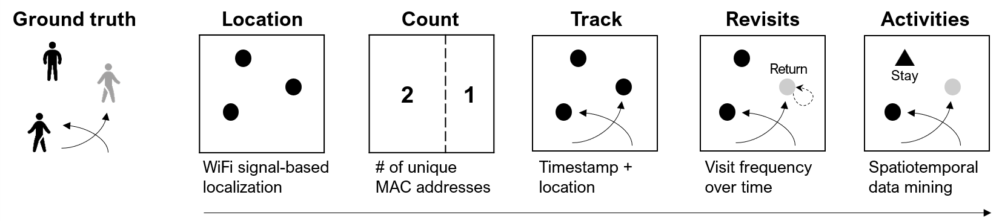

# Metrics Overview

The toolkit turns retained, pseudonymous WiFi observations into five progressively richer metrics: **Location**, **Count**, **Track**, **Revisits**, and **Activities**. This framework extends the human-sensing taxonomy in Figure 2 of @teixeiraSurveyHumansensingMethods2010 (presence, count, location, track, and identity). *Presence* is subsumed by Count, *identity* is renamed *Revisits* to describe observed visit frequency rather than personal identification, and Activities adds inferred stationary behavior. The graphic below illustrates the progression.

## Location: Where Are People at a Specific Time? {.unnumbered}

Location assigns each retained identifier-time window either to a sensor position or to an estimated coordinate between sensors, using the pattern and strength of detections received by the sensor array.

::: {.callout-note title="Why Location Comes Before Count" collapse="true"}
Before counting, we must pinpoint location. Without knowing where devices are, we just have a total count.

Imagine a room with three people, just like in the diagram above:

- **Without location data,** counting retained pseudonymous identifiers only tells you there are three observed device signals in total.
- **With even rough location data,** you can determine that two devices are on the left and one on the right, providing much richer information.
:::

## Count: How Many Over Time? {.unnumbered}

Count tallies distinct retained pseudonymous identifiers over specified windows. It measures observed device presence and relative activity patterns; it is not an uncalibrated count of people.

## Track: Where and When Did They Move? {.unnumbered}

Track links successive locations of the same retained identifier within a bounded trajectory. Aggregated origin--destination pairs reveal recurring sensor-to-sensor flows, not surveyed trips or exact pedestrian paths.

## Revisits: How Often Was an Identifier Observed? {.unnumbered}

Revisits summarizes observed frequency over a declared observation window. The commercial-district demonstration counts days on which a retained identifier produced at least one quality-filtered trajectory, then distinguishes Single-day observed from Multi-day observed. These labels do not identify a person or reveal how often that person actually visited.

## Activities: Where Are Stays Inferred? {.unnumbered}

Activities groups nearby observations into continuous episodes and classifies sufficiently long, spatially stable episodes as inferred stays. The metric distinguishes inferred stays from pass-throughs; it does not determine the activity or intent of a person.

::: {.callout-warning title="A Note on MAC Randomization"}
Modern mobile devices randomize source addresses for privacy protection. The maintained pipeline conservatively removes observations whose source address has the locally administered bit set (@sec-cleaning), so flagged records do not fragment a trajectory; they are absent from the retained sample.

- **Location** and **Count** require the least persistence, but both describe the retained sample rather than all devices or people.
- **Track** and **Activities** require one retained address to persist within a trajectory or episode.
- **Revisits** requires the retained address to recur across qualifying observation days and is therefore the most constrained.

The usable retained share is deployment-specific. Validate the retained and removed address streams at every site and calibrate absolute pedestrian estimates against independent counts; see @sec-randomization.
:::

::: {.callout-tip title="Validating with Ground Truth" collapse="true"}
To assess accuracy, we compare WiFi-derived metrics against ground truth data such as manual counts or GPS logs. The Location chapter validates position estimates against GPS ground truth; the other metrics build on those localized detections.
:::
