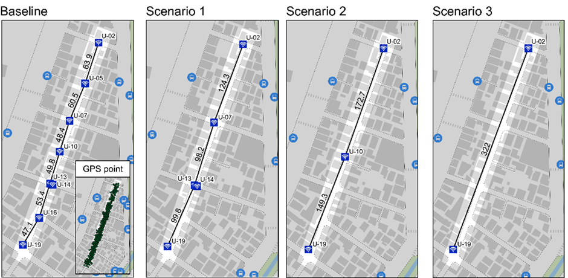
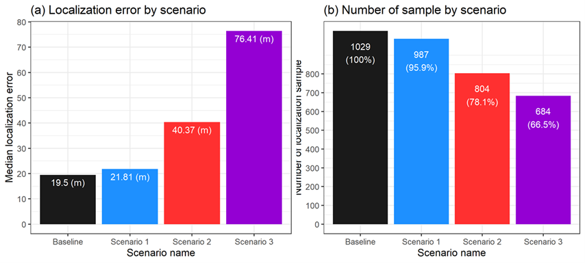
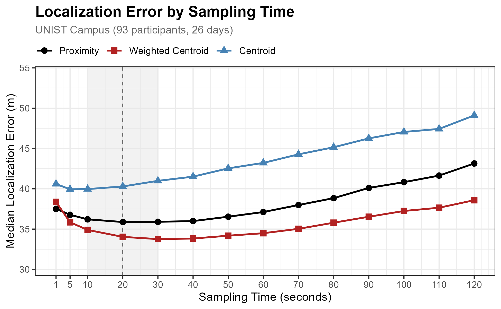
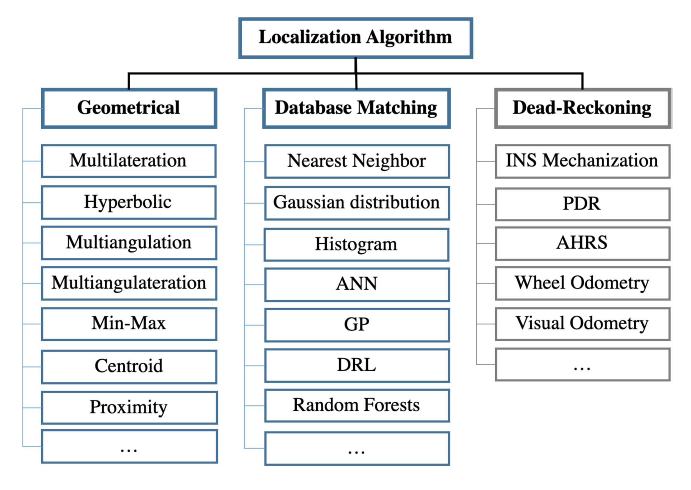

# Location {#sec-location}

Before counting or tracking devices, we must know *where* each device is. This chapter shows how to assign positions to WiFi detections, a foundational step that feeds into all downstream analyses.

WiFi sensors report **detections**, not coordinates: "device X was seen at time T with signal strength S." When coverage areas overlap, the same device appears in multiple sensor logs simultaneously. **Localization** consolidates these scattered detections into a single position estimate per time window.

This requires two decisions:

- **Temporal resolution**: How often to update a device's location? Every second captures fine-grained movement but amplifies noise; every minute smooths trajectories but misses quick stops.
- **Spatial resolution**: When multiple sensors detect the same device, which location to assign? Pick the strongest signal (*Proximity*), or compute a weighted average (*Centroid*).


## Setup

### Prepare data

Download our sample dataset to follow along, or use your own WiFi detection data: **[sample_loc.zip](downloads/sample_loc.zip)**. The ZIP contains three files: `wifi.parquet` (WiFi detections for one device), `gps.csv` (GPS ground truth), and `sensors.gpkg` (sensor locations). Extract the ZIP into a working folder named `sample_loc` before running the code below. This GPS validation subset is the one dataset kept in a separate pseudonym space: its identifiers are keyed apart from the released data so participant GPS traces cannot be joined to the full dataset.

::: {.callout-note collapse="true"}
## About the sample dataset

**Period**: October 21 – November 14, 2019. A single device with paired GPS ground truth.

**Location**: UNIST campus, Ulsan, South Korea. 26 sensors in projected coordinates (KGD2002 Central Belt 2010).

**Data structure**:

| File | Rows | Columns |
|------|------|---------|
| `wifi.parquet` | ~86,000 | `timestamp`, `source_address`, `sensor_name`, `rssi` |
| `gps.csv` | ~46,000 | `source_address`, `timestamp`, `x`, `y` |
| `sensors.gpkg` | 26 | `sensor_name`, `geom` |

**How we prepared this sample**: historical selection and restricted export are implemented in `scripts/0-4-unist19-location.R`; downstream public re-pseudonymization is implemented in `scripts/release/rekey_tutorial_data.py`.

1. Selected the device with most detections from the full dataset
2. Exported the paired restricted WiFi and GPS records and sensor coordinates
3. Replaced the retained restricted identifier in both public files with the same 32-character, release- and dataset-specific HMAC-SHA-256 pseudonym

This sample uses a single device with paired GPS ground truth, separate from the multi-device dataset used in later chapters (Count, Track, Revisits). Its 32-character pseudonym was assigned downstream when this tutorial archive was prepared for release; it must not be read as evidence that the maintained deployment-scoped HMAC collector operated in 2019.
:::

### Load packages and data

Load required packages using `pacman::p_load()`, which installs any missing packages automatically:

```{r}
#| label: setup
#| message: false
#| eval: false

pacman::p_load(tidyverse, lubridate, arrow, sf)
```

Load the data files:

```{r}
#| label: load-data
#| eval: false

sample_dir <- "sample_loc"  # folder containing the extracted ZIP
wifi_raw <- read_parquet(file.path(sample_dir, "wifi.parquet"))
gps <- read_csv(file.path(sample_dir, "gps.csv"), show_col_types = FALSE) |>
  mutate(timestamp = ymd_hms(timestamp))
sensors <- st_read(file.path(sample_dir, "sensors.gpkg"), quiet = TRUE)
```

Extract sensor coordinates for localization:

```{r}
#| label: sensor-coords
#| eval: false

sensor_locations <- sensors |>
  mutate(
    x_sensor = st_coordinates(sensors)[, 1],
    y_sensor = st_coordinates(sensors)[, 2]
  ) |>
  st_drop_geometry()
```

::: {.callout-tip collapse="true"}
## Preview loaded data

**WiFi data** (probe request detections with signal strength):

```{r}
#| label: head-wifi
#| eval: false

head(wifi_raw, 3)
```

```
           timestamp source_address sensor_name rssi
1 2019-10-21 00:01:35 b84170e4d8f3f45a54ebc86352d8c5a4 comm_center  -75
2 2019-10-21 00:01:36 b84170e4d8f3f45a54ebc86352d8c5a4 comm_center  -75
3 2019-10-21 00:01:51 b84170e4d8f3f45a54ebc86352d8c5a4 comm_center  -75
```

- `timestamp`: Detection time (second precision)
- `source_address`: 32-character lowercase release- and dataset-specific HMAC-SHA-256 pseudonym, consistent across `wifi.parquet` and `gps.csv` only within this tutorial archive
- `sensor_name`: Which sensor detected this device
- `rssi`: Signal strength in dBm (closer to zero = stronger signal)

**Sensors** (point geometries in projected coordinates):

```{r}
#| label: head-sensors
#| eval: false

head(sensor_locations, 3)
```

```
      sensor_name x_sensor  y_sensor
1     bus_station 398694.9  332932.1
2 108_front_outs~ 398418.3  332757.7
3       206_front 398305.3  332761.0
```
:::


## Pipeline

The localization pipeline has three steps: create time windows, aggregate detections by sensor, and assign each window to a location. We use **20-second windows** with *Proximity* (strongest signal wins); see @sec-method-selection for the rationale.

### Time windows

Group detections into fixed intervals. All detections within the same 20-second window will be aggregated together:

```{r}
#| label: time-windows
#| eval: false

sampling_window <- 20  # seconds

wifi_windowed <- wifi_raw |>
  mutate(
    time_window = floor_date(timestamp, paste(sampling_window, "seconds"))
  )
```

### Aggregate

Within each time window, aggregate detections per sensor. Each RSSI reading (negative dBm) is shifted by adding 100 to produce a positive score before summing, so that both more frequent and stronger detections yield a larger total:

```{r}
#| label: aggregate
#| eval: false

wifi_aggregated <- wifi_windowed |>
  group_by(source_address, time_window, sensor_name) |>
  summarise(
    strength = sum(100 + rssi),
    n_detections = n(),
    .groups = "drop"
  ) |>
  left_join(sensor_locations, by = "sensor_name")
```

The `strength` column serves as the localization score: a sensor with many strong detections accumulates a higher total than one with few weak detections.

### Assign location

Pick the sensor with strongest cumulative signal (*Proximity* method):

```{r}
#| label: localization
#| eval: false

wifi_located <- wifi_aggregated |>
  arrange(source_address, time_window, desc(strength), sensor_name) |>
  distinct(source_address, time_window, .keep_all = TRUE) |>
  select(source_address, time_window, sensor_name, x_sensor, y_sensor)

head(wifi_located)
```

```
  source_address                   time_window          sensor_name x_sensor  y_sensor
1 b84170e4d8f3f45a54ebc86352d8c5a4 2019-10-21 00:01:20  comm_center 398463.8  332750.2
2 b84170e4d8f3f45a54ebc86352d8c5a4 2019-10-21 00:01:40  comm_center 398463.8  332750.2
3 b84170e4d8f3f45a54ebc86352d8c5a4 2019-10-21 00:02:00  comm_center 398463.8  332750.2
```

Each row is now one retained pseudonymous identifier assigned to one location for one time window. Ordering by `sensor_name` makes exact signal-score ties deterministic rather than dependent on input row order.

::: {.callout-tip collapse="true"}
## Alternative: Weighted Centroid

*Proximity* assigns devices to discrete sensor locations. If you need continuous coordinates for mapping or distance calculations, compute a weighted average of all detecting sensors:

```{r}
#| label: weighted-centroid
#| eval: false

wifi_centroid <- wifi_aggregated |>
  group_by(source_address, time_window) |>
  summarise(
    x_est = sum(x_sensor * strength, na.rm = TRUE) / sum(strength, na.rm = TRUE),
    y_est = sum(y_sensor * strength, na.rm = TRUE) / sum(strength, na.rm = TRUE),
    .groups = "drop"
  )
```

$$
x_{est} = \frac{\sum_{i} w_i \cdot x_i}{\sum_{i} w_i}
$$

where $w_i = 100 + RSSI_i$. The `strength` column is the per-sensor sum of these weights within each window.
:::


## Sensor spacing

Sensor spacing matters more than localization method. When sensors are too far apart, devices pass through gaps undetected, and no algorithm can compensate for missing data.

We tested this by progressively removing sensors from our campus deployment:



Detection holds to about 100m spacing and breaks down beyond it:



::: {.callout-note collapse="true"}
## Interpreting sensor spacing results

| Spacing | Sensors | Detection Rate |
|---------|---------|----------------|
| ~50m | 25 | 100% |
| ~100m | 12 | 96% |
| ~150m | 6 | 78% |
| ~320m | 4 | 67% |

The jump from 100m to 150m is where coverage breaks down. At ~50m spacing, every device was detected; halving the network to ~100m spacing still detected 96%. Beyond that, coverage degraded rapidly: at ~150m spacing, 22% of devices were missed entirely, and the localization error visible in the figure grew accordingly. These scenario figures come from the historical sensor-density experiment on this deployment and are shown for the coverage pattern rather than the exact error values.

**Recommendation**: Keep sensors within 100m of each other. If budget forces wider spacing, accept that you'll miss significant pedestrian traffic, and counts will underestimate accordingly.
:::


## Method selection {#sec-method-selection}

Two parameters require decisions: **time window length** and **localization method**. Our validation uses GPS ground truth from multiple participants to compare approaches.

### Time window

Window length trades off temporal resolution against estimation stability. Short windows (1–10s) capture fine-grained movement but produce noisy estimates; long windows (1–3min) yield stable estimates but blur movement patterns.

We tested windows from 1 to 120 seconds against GPS ground truth from 93 participants:



::: {.callout-note collapse="true"}
## Interpreting time window results

*Weighted Centroid* reaches the lowest median error (~34m around 20–30 second windows). *Proximity* tracks it closely, within about 2m across the 10–30 second band, and its own median error is lowest at exactly 20 seconds (~36m). *Centroid* trails at ~40m. All three methods degrade slowly at longer windows, as a single window increasingly blends detections from different positions.

We default to **20 seconds** as a reasonable balance:

- Short enough to capture movement between locations
- Long enough to aggregate multiple detections for stable estimates
- Aligns well with typical pedestrian pace (~1.4 m/s = 28m in 20s)
- The GPS benchmark supports it directly: Proximity's error is minimized there
:::

### Localization method

We use *Proximity* (assign to strongest sensor) for the pipeline in subsequent chapters:

- Output maps directly to a **single sensor**, essential for discrete analyses like counting at specific locations and building OD matrices between sensors
- *Centroid* and *Weighted Centroid* produce continuous coordinates that fall *between* sensors, which cannot be used for sensor-level counting or tracking
- At the adopted 20-second window, Proximity gives up very little accuracy (~36m vs ~34m median error), so the discrete output costs almost nothing

For applications requiring precise continuous positioning (e.g., indoor navigation), *Weighted Centroid* is the better choice.

::: {.callout-note collapse="true"}
## More on localization methods

Li et al. (2021) categorize IoT localization methods by complexity and accuracy:

{width=80%}

For low-cost outdoor deployments with sparse sensor networks, only *Proximity* and *Centroid* are practical. Methods requiring precise timing (ToA, TDoA) or dense arrays (fingerprinting) demand hardware beyond typical WiFi sensing setups.

Reference: Li, You, *et al.* Toward location-enabled IoT (LE-IoT). *IEEE Internet of Things Journal*, 2020, 8.6: 4035-4062.
:::
