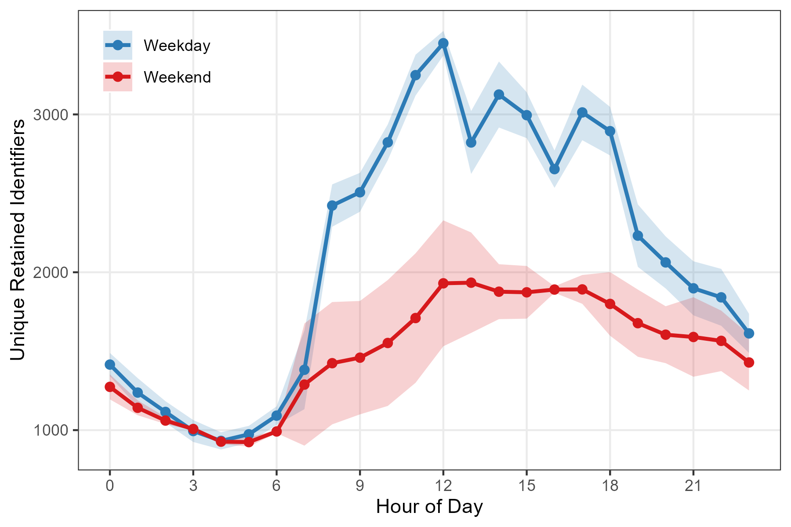
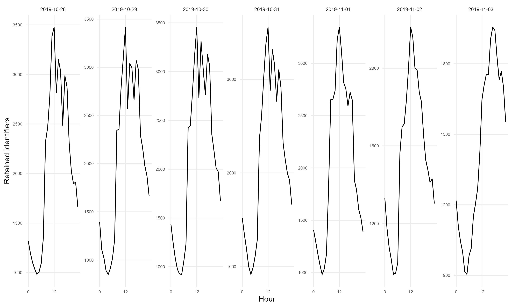
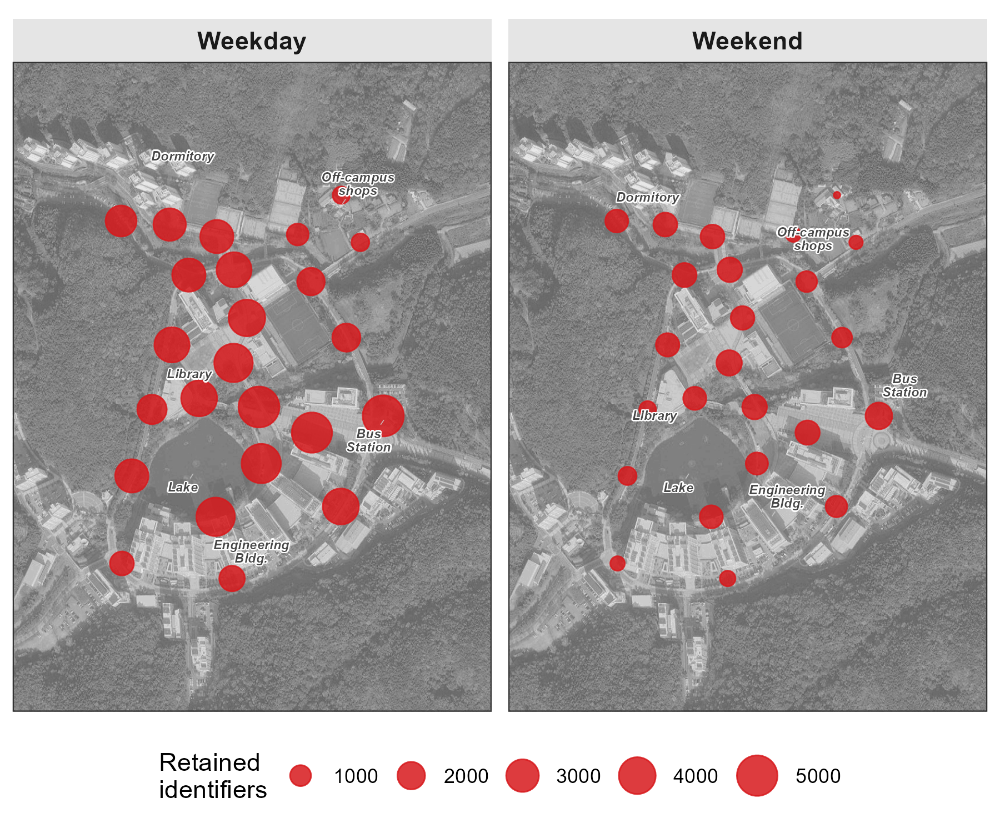

# Count {#sec-count}

While [Location](4-2-location.qmd) selects an observed sensor position, Count summarizes **how many retained identifiers** appear in a time–space interval. These values can describe relative pedestrian-activity patterns after deployment-specific validation, but they are not direct person counts.

The core metric is **distinct retained identifiers per time window**: for each sensor and time period, count distinct pseudonymous source identifiers. Temporal aggregation reveals daily rhythms; spatial aggregation reveals hotspots. Together, they characterize when and where observed activity concentrates.


## Setup

### Prepare data

Download our sample dataset to follow along, or use your own WiFi detection data: **[sample_main.zip](downloads/sample_main.zip)**. The ZIP contains three files: `wifi.parquet` (WiFi detections), `sensors.gpkg` (sensor locations), and `poi.gpkg` (campus landmarks). Extract the ZIP into a working folder named `sample_main` before running the code below. The sample is a one-week filter of the released campus dataset, with the same pseudonyms and schema, so anything observed here can be followed into the full data. Timestamps are stored in UTC as in the release; the load step converts them once to `Asia/Seoul` so dates and hours follow the local calendar.

::: {.callout-note collapse="true"}
## About the sample dataset

**Period**: October 28 – November 3, 2019 (one week). Includes a campus interview event (Nov 1–2) and the start of a school festival (Nov 3).

**Location**: UNIST campus, Ulsan, South Korea. 24 outdoor sensors covered dormitories, academic buildings, cafeteria, library, gym, and bus station.

**Data structure**:

| File | Rows | Columns |
|------|------|---------|
| `wifi.parquet` | ~4.2M | `timestamp`, `source_address`, `sensor_name`, `rssi_median`, `rssi_sum`, `detections` |
| `sensors.gpkg` | 24 | `sensor_name`, `geom` |
| `poi.gpkg` | 6 | `name`, `geom` |

**How we prepared this sample**: `scripts/0-8-sample-main-from-release.R` filters the released campus dataset (`data/release-20sec/wifi_unist19_20sec.parquet`) to one local calendar week, 2019-10-28 through 2019-11-03 (Asia/Seoul). Pseudonyms, schema, and values are identical to the release.

1. The release itself was cleaned upstream: randomized MACs (locally-administered bit), stationary devices, and devices with fewer than 5 detections were removed, and retained observations were aggregated to 20-second windows
2. Release- and dataset-specific HMAC-SHA-256 pseudonyms were assigned downstream when the release was built
3. The sample keeps one week of that release, unchanged

These 32-character release pseudonyms were assigned downstream when the release was built.
:::

### Load packages and data

Load required packages using `pacman::p_load()`, which installs any missing packages automatically:

```{r}
#| label: setup
#| message: false
#| eval: false

pacman::p_load(tidyverse, lubridate, arrow, sf, ggmap, ggrepel)
```

Load the data files:

```{r}
#| label: load-data
#| eval: false

sample_dir <- "sample_main"  # folder containing the extracted ZIP
wifi_raw <- read_parquet(file.path(sample_dir, "wifi.parquet")) |>
  mutate(timestamp = with_tz(timestamp, "Asia/Seoul"))
sensors <- st_read(file.path(sample_dir, "sensors.gpkg"), quiet = TRUE)
poi <- st_read(file.path(sample_dir, "poi.gpkg"), quiet = TRUE)
```

::: {.callout-tip collapse="true"}
## Preview loaded data

**WiFi data** (20-second aggregated detections):

```{r}
#| label: head-wifi
#| eval: false

head(wifi_raw, 3)
```

```
            timestamp                   source_address          sensor_name rssi_median rssi_sum detections
1 2019-10-28 00:00:00 058d412bd4c8729dfad1d924006c7e06    108_front_outside         -69      -69          1
2 2019-10-28 00:00:00 058d412bd4c8729dfad1d924006c7e06 bridge_main_engineer         -73      -73          1
3 2019-10-28 00:00:00 1063540d3c6c1dd7492972f2d16a2760            203_front         -64      -64          1
```

- `timestamp`: Start of 20-second aggregation window
- `source_address`: 32-character lowercase release- and dataset-specific HMAC-SHA-256 pseudonym; values match the released campus dataset, so sample observations can be followed into the full data
- `sensor_name`: Which sensor detected this device
- `rssi_median`: Median signal strength in dBm within the window
- `rssi_sum`: Sum of raw RSSI values (negative dBm) within the window
- `detections`: Number of 1-second slots with at least one detection

The localization score `strength_sum` (equal to `sum(100 + RSSI)` across the window's detections) is not shipped in this public file. The chapters that localize devices ([Track](4-4-track.qmd), [Activities](4-6-activities.qmd)) restore it at load time with `mutate(strength_sum = 100 * detections + rssi_sum)`, the toolkit's convention for public files. Counting works directly on the shipped columns.

**Sensors** (point geometries with location coordinates):

```{r}
#| label: head-sensors
#| eval: false

head(sensors, 3)
```

```
Simple feature collection with 3 features and 1 field
Geometry type: POINT
Geodetic CRS:  WGS 84
      sensor_name                      geom
1     bus_station POINT (129.1918 35.57348)
2 108_front_outs~ POINT (129.1887 35.57197)
3        112_side  POINT (129.187 35.57127)
```
:::


## Pipeline

### Hourly counts

Aggregate detections into hourly counts by counting unique retained identifiers across all sensors:

```{r}
#| label: hourly-counts
#| eval: false

hourly_counts <- wifi_raw |>
  mutate(
    hour = floor_date(timestamp, "hour"),
    day_type = if_else(wday(timestamp) %in% c(1, 7), "Weekend", "Weekday")
  ) |>
  group_by(hour, day_type) |>
  summarise(n_devices = n_distinct(source_address), .groups = "drop")

head(hourly_counts)
```

```
# A tibble: 6 x 3
  hour                day_type n_devices
  <dttm>              <chr>        <int>
1 2019-10-28 00:00:00 Weekday       1316
2 2019-10-28 01:00:00 Weekday       1192
3 2019-10-28 02:00:00 Weekday       1100
4 2019-10-28 03:00:00 Weekday       1035
5 2019-10-28 04:00:00 Weekday        982
6 2019-10-28 05:00:00 Weekday       1008
```

The `day_type` column distinguishes weekday from weekend patterns. University campuses show pronounced differences between the two.

### Average daily pattern

Collapse across days to compute the typical hourly rhythm:

```{r}
#| label: hourly-pattern
#| eval: false

hourly_pattern <- hourly_counts |>
  mutate(hour_of_day = hour(hour)) |>
  group_by(hour_of_day, day_type) |>
  summarise(
    mean_devices = mean(n_devices),
    sd_devices = sd(n_devices),
    .groups = "drop"
  )
```


## Temporal patterns

Plot the average hourly pattern with standard deviation bands:

```{r}
#| label: plot-hourly
#| eval: false

ggplot(hourly_pattern, aes(x = hour_of_day, y = mean_devices,
                           color = day_type, fill = day_type)) +
  geom_ribbon(aes(ymin = pmax(0, mean_devices - sd_devices),
                  ymax = mean_devices + sd_devices),
              alpha = 0.2, color = NA) +
  geom_line(linewidth = 1) +
  geom_point(size = 2) +
  scale_x_continuous(breaks = seq(0, 23, by = 3)) +
  scale_color_manual(values = c("Weekday" = "#2c7bb6", "Weekend" = "#d7191c")) +
  scale_fill_manual(values = c("Weekday" = "#2c7bb6", "Weekend" = "#d7191c")) +
  labs(x = "Hour of Day", y = "Unique Retained Identifiers", color = NULL, fill = NULL) +
  theme_bw()
```



::: {.callout-note collapse="true"}
## Interpreting the temporal pattern

The weekday curve rises sharply after 7 AM, peaks near noon at about 3,500 retained identifiers per hour, remains elevated through the afternoon, and tapers after 7 PM. The weekend curve is flatter and peaks around midday–afternoon at about 1,950 identifiers, roughly half the weekday maximum.

Key observations:

- **Peak timing**: Weekdays peak at noon (lunch hour); weekends show a broader plateau from noon to early evening
- **Morning ramp**: Weekdays show a steep 7–9 AM increase; weekends rise more gradually
- **Evening decay**: Both patterns decline after 7pm, but the weekend curve falls more gently, retaining a larger share of its daytime peak into late night
:::

::: {.callout-tip collapse="true"}
## Calendar view

A calendar-style small multiples plot reveals day-to-day variability. Special events or weather disruptions appear as anomalies against the regular rhythm.

```{r}
#| label: calendar-view
#| eval: false

daily_hourly <- wifi_raw |>
  mutate(
    date = as_date(timestamp),
    hour_of_day = hour(timestamp)
  ) |>
  group_by(date, hour_of_day) |>
  summarise(n_devices = n_distinct(source_address), .groups = "drop")

ggplot(daily_hourly, aes(x = hour_of_day, y = n_devices)) +
  geom_line(linewidth = 0.5) +
  facet_wrap(~ date, ncol = 7, scales = "free_y") +
  labs(x = "Hour", y = "Retained identifiers") +
  theme_minimal()
```



The calendar view reveals which days deviate from the typical pattern. Campus events or holidays become visible as unusual curves among the regular rhythm.
:::


## Spatial patterns

Counts vary by sensor location. Mapping retained-identifier counts shows where this deployment recorded relatively more or fewer identifiers during the selected hours.

### Sensor-level aggregation

Count unique retained identifiers per sensor, filtering to midday hours (11 AM–3 PM):

```{r}
#| label: sensor-counts
#| eval: false

sensor_counts <- wifi_raw |>
  mutate(
    day_type = if_else(wday(timestamp) %in% c(1, 7), "Weekend", "Weekday"),
    hour_of_day = hour(timestamp)
  ) |>
  filter(hour_of_day >= 11 & hour_of_day <= 14) |>
  group_by(sensor_name, day_type) |>
  summarise(n_devices = n_distinct(source_address), .groups = "drop")
```

### Map visualization

Join counts with sensor coordinates and plot on a basemap. Circle size encodes device count:

```{r}
#| label: map-counts
#| eval: false

sensors_with_counts <- sensors |>
  left_join(sensor_counts, by = "sensor_name")

ggmap(base_map, darken = c(0.3, "white")) +
  geom_sf(data = sensors_with_counts, aes(size = n_devices),
          color = "#d7191c", alpha = 0.85, inherit.aes = FALSE) +
  scale_size_continuous(range = c(1, 8), name = "Retained\nidentifiers") +
  facet_wrap(~ day_type) +
  theme_bw() +
  theme(axis.title = element_blank(), axis.text = element_blank(), axis.ticks = element_blank())
```



::: {.callout-note collapse="true"}
## Reading the spatial pattern

With the known campus land uses as context, the map shows these descriptive contrasts:

- **Dormitory-area sensors**: the smallest weekday-to-weekend decline
- **Engineering-building sensors**: pronounced weekday peaks
- **Cafeteria-area sensors**: comparatively high counts on both day types, with a larger weekday midday value
- **Bus-station sensor**: a larger weekday than weekend count

These associations are compatible with the documented site functions and schedule, but the retained identifiers do not reveal individual purpose, occupancy, or complete pedestrian totals.
:::


## Note on MAC randomization

Modern devices can change source addresses for privacy, which can split one device's observations across identifiers. Address persistence and emission behavior therefore affect every count.

The historical preprocessing evaluated the locally administered bit on the observed address and **removed** flagged records. The released tutorial archive then replaced each retained restricted identifier with a 32-character, release- and dataset-specific HMAC-SHA-256 pseudonym (historical preprocessing: `scripts/0-3-unist19-prep.R`; public re-pseudonymization: `scripts/release/rekey_tutorial_data.py`). The counts in this chapter therefore reflect only the retained, non-flagged stream.

::: {.callout-note collapse="true"}
## How the locally administered flag is identified

The U/L bit in the first octet indicates whether an observed address is locally administered. It is a conservative filtering flag, not proof of random generation:

```{r}
#| label: random-mac-logic
#| eval: false

# Applied to restricted raw addresses during historical preprocessing:
is_locally_administered <- function(mac) {
  second_char <- substr(tolower(mac), 2, 2)
  second_char %in% c("2", "3", "6", "7", "a", "b", "e", "f")
}
```

Once an address has been pseudonymized, its original bit structure is unavailable. The maintained collector therefore evaluates and stores the flag *before* HMAC processing; the historical pipeline evaluated the same bit before downstream public re-pseudonymization.
:::

::: {.callout-warning}
## Limitations of removal-based filtering

Removing locally administered addresses is conservative: it avoids rotation-inflated address counts but also discards observations from devices that use private addresses. The result is a count of **retained pseudonymous identifiers**, not a guaranteed lower or upper bound on people; one person may carry multiple devices, some devices emit no usable observations, and residual non-pedestrian sources may remain.

Use these counts directly for relative temporal or spatial patterns only after validating the retained and removed streams for the deployment (@sec-rand-validation). Absolute pedestrian estimates require independent calibration, such as manual counts at representative times and locations.
:::
