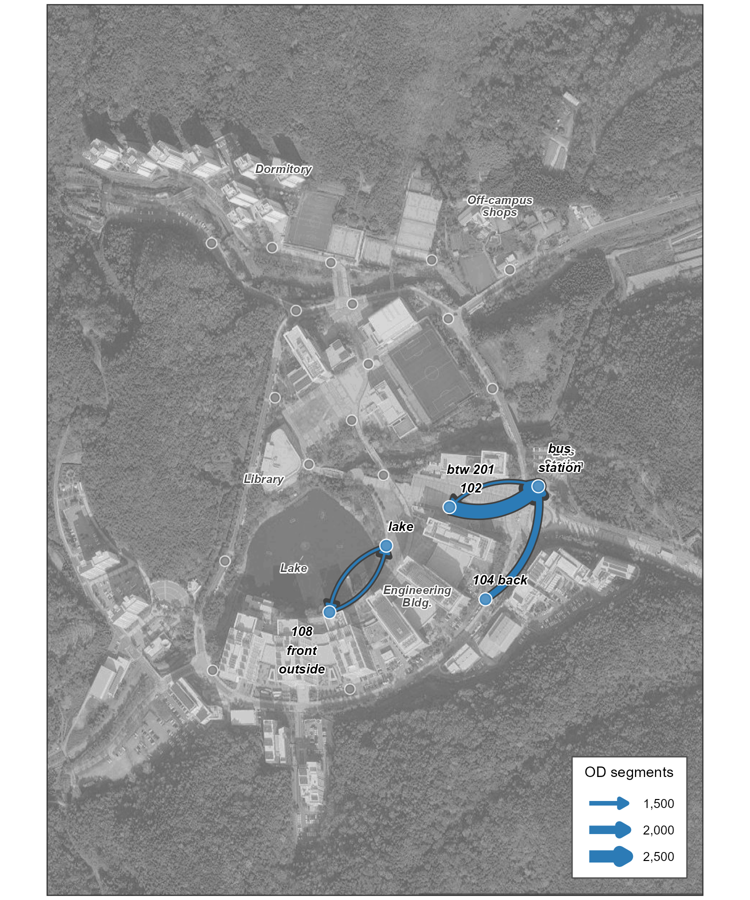
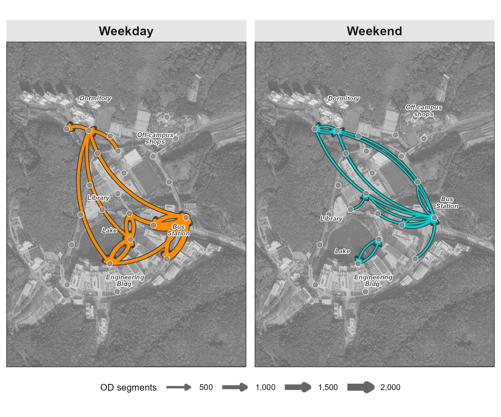
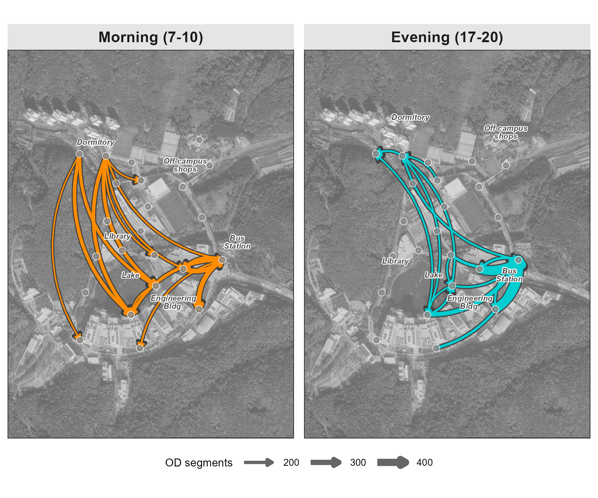

# Track {#sec-track}

While [Count](4-3-count.qmd) summarizes observed presence, Track links successive locations of the same retained pseudonymous identifier. This chapter builds origin--destination (OD) matrices and flow maps that reveal recurring observed sensor-to-sensor flows across a study area.

The core concept is the **trajectory**: a sequence of localized observations for one retained identifier, bounded by gaps of inactivity. In this campus example, a gap of more than 30 minutes starts a new trajectory. Its first and last observed sensors define an OD pair. Aggregating these pairs reveals which observed sensor-to-sensor flows dominate and how they shift by time of day or day of week.


## Setup

### Prepare data

Download our sample dataset to follow along, or use your own WiFi detection data: **[sample_main.zip](downloads/sample_main.zip)**. The ZIP contains three files: `wifi.parquet` (WiFi detections), `sensors.gpkg` (sensor locations), and `poi.gpkg` (campus landmarks). Extract the ZIP into a working folder named `sample_main` before running the code below. The sample is a one-week filter of the released campus dataset, with the same pseudonyms and schema, so anything observed here can be followed into the full data. Timestamps are stored in UTC as in the release; the load step converts them once to `Asia/Seoul` so dates and hours follow the local calendar.

::: {.callout-note collapse="true"}
## About the sample dataset

This chapter uses the same UNIST campus dataset introduced in [Count](4-3-count.qmd): see that chapter for the period, sensor coverage, schema, and preparation steps.
:::

### Load packages and data

The code blocks below are displayed rather than executed when the book is rendered. `scripts/4-4-track.R` runs the same steps end to end.

Load required packages using `pacman::p_load()`, which installs any missing packages automatically:

```{r}
#| label: setup
#| message: false
#| eval: false

pacman::p_load(tidyverse, lubridate, arrow, sf, ggmap, ggrepel)
```

Load the data files. The public file ships without the `strength_sum` localization score, so we restore it right away, the toolkit's convention for public files:

```{r}
#| label: load-data
#| eval: false

sample_dir <- "sample_main"  # folder containing the extracted ZIP
wifi_raw <- read_parquet(file.path(sample_dir, "wifi.parquet")) |>
  mutate(
    timestamp = with_tz(timestamp, "Asia/Seoul"),
    strength_sum = 100 * detections + rssi_sum
  )
sensors <- st_read(file.path(sample_dir, "sensors.gpkg"), quiet = TRUE)
poi <- st_read(file.path(sample_dir, "poi.gpkg"), quiet = TRUE)
```

### Configure basemap

Flow maps overlay movement data on a geographic basemap. Choose one of these options:

::: {.panel-tabset}

## Google Maps

For satellite imagery, register a [Google Maps API key](https://developers.google.com/maps/documentation/maps-static/get-api-key):

```{r}
#| label: basemap-google
#| eval: false

register_google(key = "YOUR_API_KEY")

bbox <- st_bbox(sensors)
base_map <- get_map(
  location = c(lon = mean(bbox[c(1,3)]), lat = mean(bbox[c(2,4)])),
  zoom = 16, maptype = "satellite", source = "google"
)
```

## OpenStreetMap

For a free alternative (no API key required):

```{r}
#| label: basemap-osm
#| eval: false

bbox <- st_bbox(sensors)
base_map <- get_stadiamap(
  bbox = c(left = bbox["xmin"], bottom = bbox["ymin"],
           right = bbox["xmax"], top = bbox["ymax"]),
  zoom = 16, maptype = "stamen_toner_lite"
)
```

:::

Extract sensor coordinates for plotting:

```{r}
#| label: sensor-coords
#| eval: false

sensor_coords <- sensors |>
  st_coordinates() |>
  as_tibble() |>
  bind_cols(sensors |> st_drop_geometry() |> select(sensor_name))
```

::: {.callout-tip collapse="true"}
## Preview loaded data

**WiFi data** (20-second aggregated detections):

```{r}
#| label: head-wifi
#| eval: false

head(wifi_raw, 3)
```

```
            timestamp                   source_address          sensor_name rssi_median rssi_sum detections strength_sum
1 2019-10-28 00:00:00 058d412bd4c8729dfad1d924006c7e06    108_front_outside         -69      -69          1           31
2 2019-10-28 00:00:00 058d412bd4c8729dfad1d924006c7e06 bridge_main_engineer         -73      -73          1           27
3 2019-10-28 00:00:00 1063540d3c6c1dd7492972f2d16a2760            203_front         -64      -64          1           36
```

- `timestamp`: Start of 20-second aggregation window
- `source_address`: 32-character lowercase release- and dataset-specific HMAC-SHA-256 pseudonym; values match the released campus dataset, so sample observations can be followed into the full data
- `sensor_name`: Sensor that retained the aggregated observation
- `rssi_median`: Median signal strength in dBm within the window
- `rssi_sum`: Sum of raw RSSI values (negative dBm) within the window
- `detections`: Number of 1-second slots with at least one detection
- `strength_sum`: Localization score, equal to `sum(100 + RSSI)` across the window's detections; restored in the load step above as `100 * detections + rssi_sum`

**Sensors** (point geometries with location coordinates):

```{r}
#| label: head-sensors
#| eval: false

head(sensors, 5)
```

```
Simple feature collection with 5 features and 1 field
Geometry type: POINT
Geodetic CRS:  WGS 84
      sensor_name                      geom
1     bus_station POINT (129.1918 35.57348)
2 108_front_outside POINT (129.1887 35.57197)
3        112_side  POINT (129.187 35.57127)
4        104_back  POINT (129.191 35.57212)
5        108_back  POINT (129.189 35.57104)
```

**POI** (reference labels for the map):

```{r}
#| label: head-poi
#| eval: false

poi
```

```
Simple feature collection with 6 features and 1 field
Geometry type: POINT
Geodetic CRS:  WGS 84
               name                      geom
1         Dormitory POINT (129.1878 35.57708)
2           Library  POINT (129.1879 35.5738)
3       Bus Station POINT (129.1919 35.57353)
4 Engineering Bldg. POINT (129.1897 35.57187)
5  Off-campus shops  POINT (129.191 35.57656)
6              Lake POINT (129.1884 35.57273)
```
:::


## Pipeline

### Localize

Each retained identifier-window may contain observations from multiple sensors. Before building trajectories, select one sensor at each timestamp using `strength_sum = sum(100 + RSSI)` and break exact score ties by `sensor_name`:

```{r}
#| label: localize
#| eval: false

wifi <- wifi_raw |>
  arrange(source_address, timestamp, desc(strength_sum), sensor_name) |>
  distinct(source_address, timestamp, .keep_all = TRUE) |>
  select(source_address, timestamp, sensor_name)
```

This reduces the dataset from about 4.2 million rows to about 2.7 million by keeping one deterministic sensor assignment per identifier-window.

### Define trajectories

Segment the localized observations into trajectories. For each retained identifier, calculate the time gap between consecutive observations. When the gap exceeds 30 minutes, start a new trajectory:

```{r}
#| label: define-trajectories
#| eval: false

gap_threshold <- 30  # minutes

trajectories <- wifi |>
  arrange(source_address, timestamp) |>
  group_by(source_address) |>
  mutate(
    time_gap = as.numeric(difftime(timestamp, lag(timestamp), units = "mins")),
    new_trajectory = is.na(time_gap) | time_gap > gap_threshold,
    trajectory_id = cumsum(new_trajectory)
  ) |>
  ungroup()
```

### Extract OD pairs

For each trajectory, extract the first and last observed sensors. Exclude trajectories with identical endpoints or fewer than two localized observations:

```{r}
#| label: extract-od
#| eval: false

od_pairs <- trajectories |>
  group_by(source_address, trajectory_id) |>
  summarise(
    origin = first(sensor_name),
    destination = last(sensor_name),
    trajectory_start = min(timestamp),
    trajectory_end = max(timestamp),
    n_detections = n(),
    .groups = "drop"
  ) |>
  filter(
    origin != destination,
    n_detections >= 2
  )
```

### Build OD matrix

Count trajectory segments between each endpoint pair and compute their within-origin shares. This creates an OD matrix of observed first-to-last sensor pairs:

```{r}
#| label: od-matrix
#| eval: false

od_counts <- od_pairs |>
  count(origin, destination, name = "n_segments")

od_probs <- od_counts |>
  group_by(origin) |>
  mutate(
    total_from = sum(n_segments),
    prob = n_segments / total_from
  ) |>
  ungroup()

od_probs |>
  filter(origin == "104_back") |>
  arrange(desc(n_segments)) |>
  head(3)
```

```
# A tibble: 3 x 5
  origin   destination        n_segments total_from   prob
  <chr>    <chr>                  <int>      <int>  <dbl>
1 104_back bus_station             1691       5001  0.338
2 104_back bridge_main_engineer     388       5001  0.078
3 104_back 108_back                 383       5001  0.077
```

Among qualifying segments whose first sensor is `104_back`, 34% end at `bus_station` and 8% at `bridge_main_engineer`. These are endpoint shares, not mode-specific travel probabilities.


## Flow map

Flow maps display observed OD pairs on a geographic basemap, with arrows showing endpoint direction and line thickness encoding segment count.

Select the top OD pairs and join with sensor coordinates:

```{r}
#| label: flow-map-data
#| eval: false

top_n <- 5

edges_top <- od_probs |>
  slice_max(n_segments, n = top_n) |>
  left_join(sensor_coords, by = c("origin" = "sensor_name")) |>
  rename(x_from = X, y_from = Y) |>
  left_join(sensor_coords, by = c("destination" = "sensor_name")) |>
  rename(x_to = X, y_to = Y)

edges_top |> select(origin, destination, n_segments)
```

```
# A tibble: 5 x 3
  origin              destination     n_segments
  <chr>               <chr>               <int>
1 btw_201_102         bus_station          2646
2 104_back            bus_station          1691
3 lake                108_front_outside    1234
4 108_front_outside   lake                 1203
5 bus_station         btw_201_102          1189
```

Plot the flow map with curved arrows. Three small touches make flows legible on a satellite basemap: a **grey casing** drawn slightly wider under each colored arrow separates it from the imagery, **double-ring nodes** (a white ring under a colored dot) keep sensors visible on any background, and a **white halo** behind each label does the same for text. Pre-scaling the widths ourselves (instead of mapping `n_segments` directly) lets the casing track the flow width while the legend still shows real segment counts:

```{r}
#| label: flow-map-plot
#| eval: false

# Get labels for sensors in top flows
od_sensors <- unique(c(edges_top$origin, edges_top$destination))
sensor_labels <- sensor_coords |>
  filter(sensor_name %in% od_sensors)

# Pre-scale widths: casing sits 0.7 wider than the colored flow
width_breaks <- c(1500, 2000, 2500)
edges_top <- edges_top |>
  mutate(w_main = scales::rescale(n_segments, to = c(0.5, 3)),
         w_out  = w_main + 0.7)

ggmap(base_map, darken = c(0.3, "white")) +
  geom_curve(data = edges_top,
             aes(x = x_from, y = y_from, xend = x_to, yend = y_to,
                 linewidth = w_out),
             color = "grey25", curvature = 0.3,
             arrow = arrow(length = unit(2, "mm"), type = "closed"),
             show.legend = FALSE) +
  geom_curve(data = edges_top,
             aes(x = x_from, y = y_from, xend = x_to, yend = y_to,
                 linewidth = w_main),
             color = "#2c7bb6", curvature = 0.3,
             arrow = arrow(length = unit(1.5, "mm"), type = "closed")) +
  scale_linewidth_identity(
    name   = "OD segments",
    breaks = scales::rescale(width_breaks,
                             from = range(edges_top$n_segments), to = c(0.5, 3)),
    labels = scales::comma(width_breaks),
    guide  = guide_legend(override.aes = list(color = "#2c7bb6"))) +
  geom_point(data = sensor_labels, aes(x = X, y = Y),
             size = 2.5, color = "white") +
  geom_point(data = sensor_labels, aes(x = X, y = Y),
             size = 2, color = "#2c7bb6") +
  geom_text_repel(data = sensor_labels, aes(x = X, y = Y, label = sensor_name),
                  size = 2.5, fontface = "bold.italic",
                  bg.color = "white", bg.r = 0.15) +
  theme_void()
```



::: {.callout-note collapse="true"}
## Reading the flow patterns

The largest endpoint counts involve the bus-station sensor:

- **btw_201_102 → bus_station**: 2,646 segments, the largest observed endpoint pair
- **104_back → bus_station**: 1,691 segments
- **lake ↔ 108_front_outside**: 1,234 / 1,203 segments in the two directions

The reverse `bus_station → btw_201_102` pair contains 1,189 segments. Known site functions provide context, but endpoint pairs do not reveal the exact route or travel mode.
:::


## Temporal patterns

Observed endpoint patterns vary by time. The same OD pairs can be grouped by weekday/weekend or by morning/evening to describe temporal contrasts.

### Weekday vs Weekend

Split OD pairs by day type to compare weekday and weekend segment counts:

```{r}
#| label: od-daytype
#| eval: false

od_by_daytype <- od_pairs |>
  mutate(day_type = if_else(wday(trajectory_start) %in% c(1, 7),
                            "Weekend", "Weekday")) |>
  count(origin, destination, day_type, name = "n_segments")

# Top 3 endpoint pairs per day type
od_by_daytype |>
  group_by(day_type) |>
  slice_max(n_segments, n = 3)
```

```
# A tibble: 6 x 4
  day_type origin              destination     n_segments
  <chr>    <chr>               <chr>               <int>
1 Weekday  btw_201_102         bus_station          2104
2 Weekday  104_back            bus_station          1398
3 Weekday  bus_station         btw_201_102          1025
4 Weekend  btw_201_102         bus_station           542
5 Weekend  dorm_front          bus_station           303
6 Weekend  104_back            bus_station           293
```



::: {.callout-note collapse="true"}
## Weekday vs Weekend differences

- **Volume**: the largest weekday pair contains 2,104 segments, 3.9 times the largest weekend pair (542)
- **Bus-station endpoint**: several leading pairs end at `bus_station` on both day types
- **Dormitory-area endpoints**: `dorm_front → bus_station` rises to second on weekends, and `parking_dorm → bus_station` enters the weekend top set
- **Lake-area endpoint**: `108_front_outside → lake` enters the weekend top five

These are rank and count changes among retained trajectories, not evidence of trip purpose or population composition.
:::


### Morning vs Evening

Compare weekday morning (7–10 AM) and evening (5–8 PM) flows to describe directional asymmetry:

```{r}
#| label: od-timeperiod
#| eval: false

od_time_period <- od_pairs |>
  filter(wday(trajectory_start) %in% 2:6) |>  # weekdays only
  mutate(
    hour = hour(trajectory_start),
    time_period = case_when(
      hour >= 7 & hour < 10 ~ "Morning (7-10)",
      hour >= 17 & hour < 20 ~ "Evening (17-20)",
      TRUE ~ NA_character_
    )
  ) |>
  filter(!is.na(time_period)) |>
  count(origin, destination, time_period, name = "n_segments")

# Top 3 endpoint pairs per time period
od_time_period |>
  group_by(time_period) |>
  slice_max(n_segments, n = 3)
```

```
# A tibble: 6 x 4
  time_period     origin              destination     n_segments
  <chr>           <chr>               <chr>               <int>
1 Evening (17-20) 104_back            bus_station           481
2 Evening (17-20) btw_201_102         bus_station           449
3 Evening (17-20) 108_front_outside   bus_station           246
4 Morning (7-10)  bus_station         104_back              269
5 Morning (7-10)  btw_201_102         bus_station           268
6 Morning (7-10)  bus_station         btw_201_102           218
```



::: {.callout-note collapse="true"}
## Morning vs Evening asymmetry

The observed segments show directional asymmetry:

- **Evening**: the two largest pairs ending at `bus_station` contain 481 and 449 segments
- **Morning**: `bus_station → 104_back` contains 269 segments and `bus_station → btw_201_102` contains 218
- **Direction**: the leading evening pairs point toward `bus_station`, while two leading morning pairs begin there

This timing is compatible with the documented campus schedule, but the observations do not identify students, travel mode, exact arrivals or departures, or individual commute behavior.
:::

::: {.callout-warning title="Interpretation boundary"}
An OD pair is the first and last sensor assigned to a retained pseudonymous identifier within one threshold-defined trajectory. It is not a surveyed trip, an exact route, or proof of a person's origin and destination. Coverage gaps, address filtering, sensor spacing, and the 30-minute threshold all shape the resulting flows.
:::
