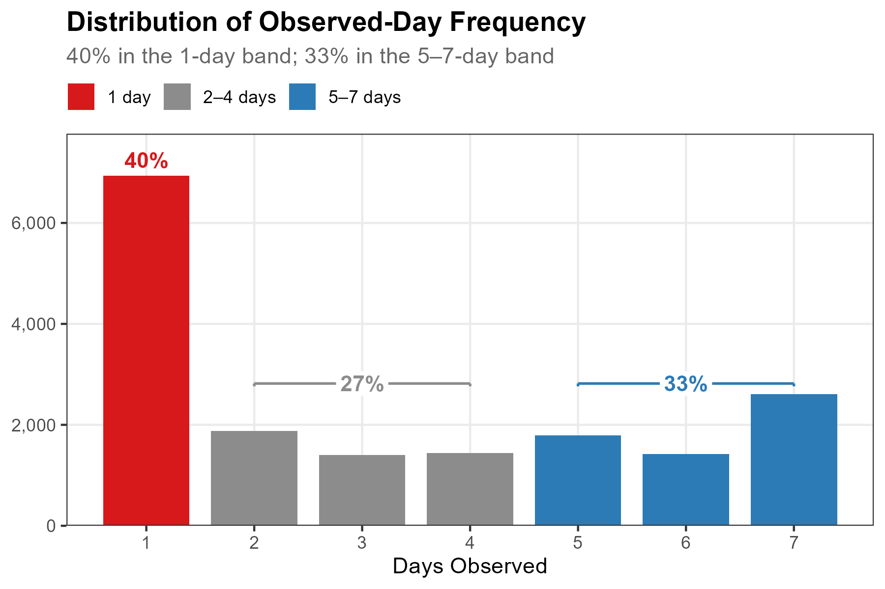
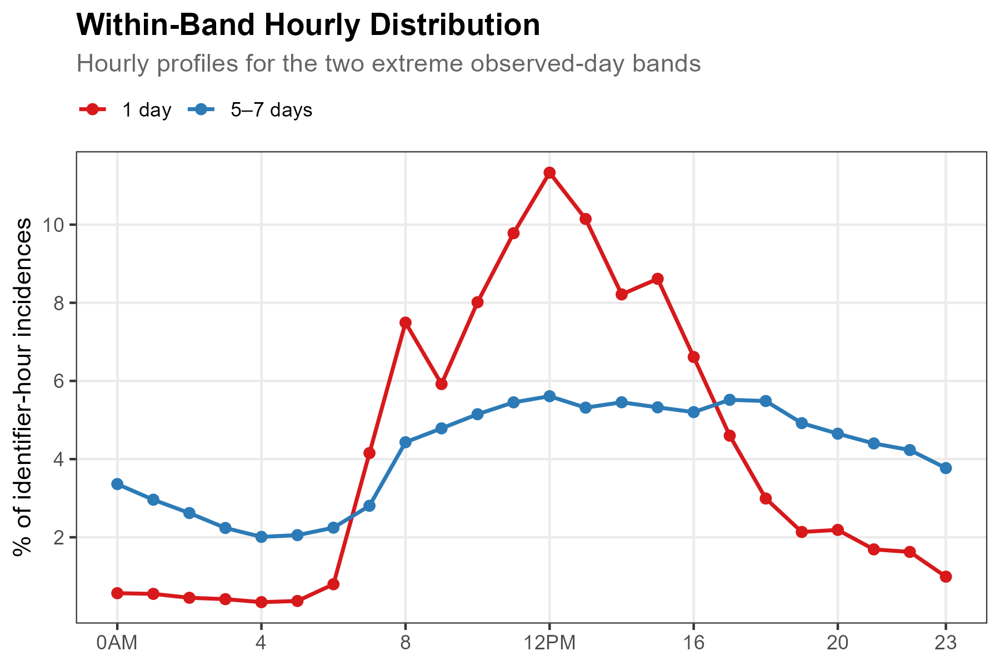
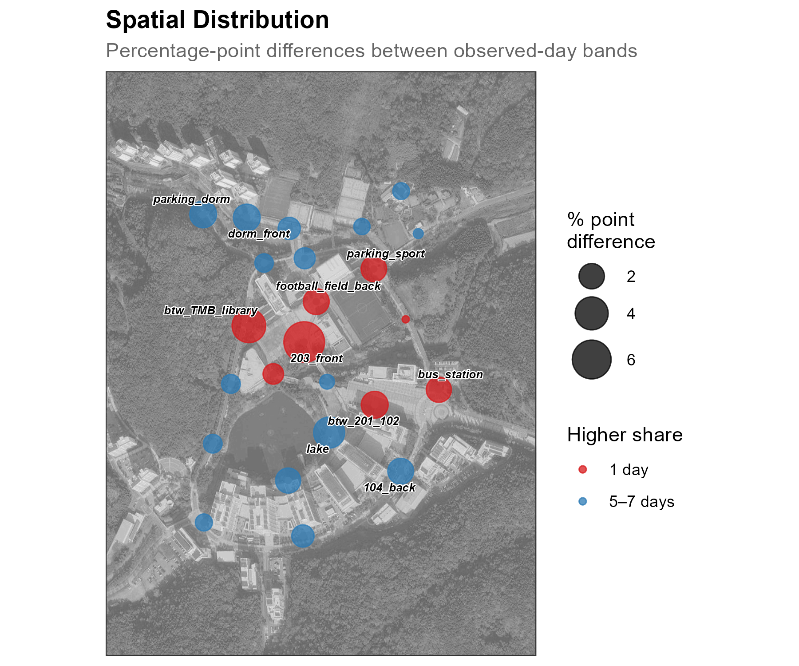
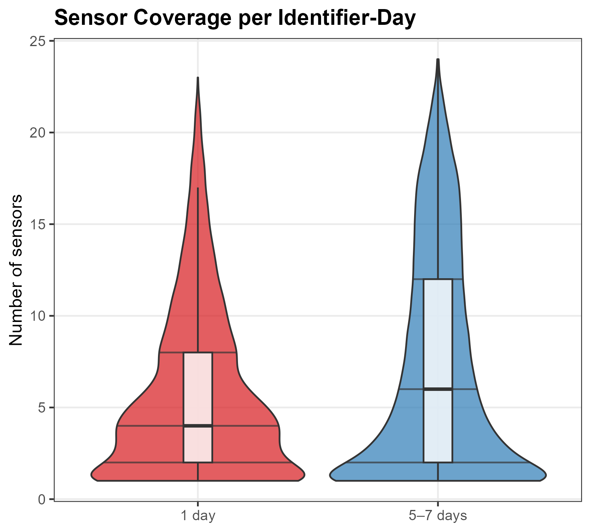
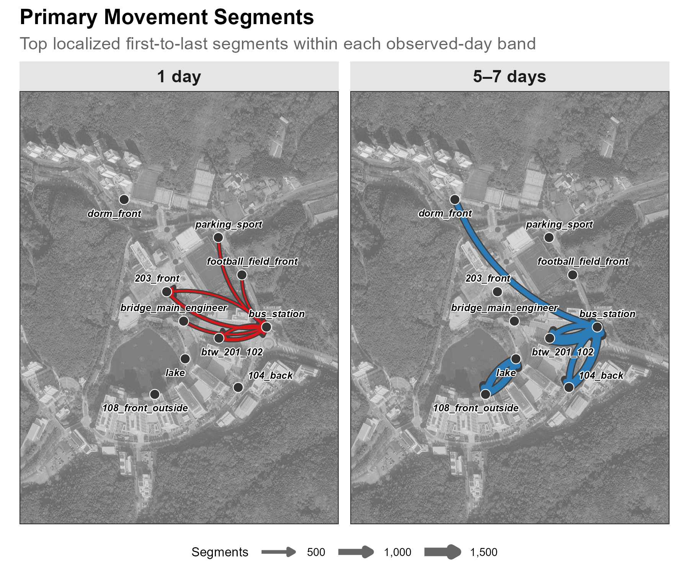

# Revisits {#sec-revisits}

While [Track](4-4-track.qmd) reconstructs sensor-level trajectories, Revisits summarizes **how often each retained identifier appears across observation days**. It is an observed-frequency metric: it does not identify a person, establish residence, or prove that an identifier represents one physical device beyond the pseudonym-stability boundary of the dataset.

This metric was formerly termed *identity*, following Teixeira et al.'s human-sensing taxonomy. We use *Revisits* to reflect the metric's narrower analytical scope: repeated observation of a pseudonymous identifier, not personal identification.

The tutorial groups identifiers into three descriptive bands—**1 day**, **2–4 days**, and **5–7 days**—then compares observable temporal, spatial, coverage, and segment-endpoint patterns. These labels describe this seven-day deployment only; they are not demographic or behavioral classes.

::: {.callout-important}
## Report the observation-day rule

In this campus tutorial, an observation day is any date with at least one retained detection row for an identifier. The commercial-street demonstration in [Case Study](5-2-casestudy.qmd) instead counts dates with at least one **quality-filtered trajectory**. Those denominators answer related but non-interchangeable questions, so every analysis should state its eligibility rule and deployment window.
:::


## Setup

### Prepare data

Download our sample dataset to follow along, or use your own WiFi detection data: **[sample_main.zip](downloads/sample_main.zip)**. The ZIP contains three files: `wifi.parquet` (WiFi detections), `sensors.gpkg` (sensor locations), and `poi.gpkg` (campus landmarks). Extract the ZIP into a working folder named `sample_main` before running the code below. The sample is a one-week filter of the released campus dataset, with the same pseudonyms and schema, so anything observed here can be followed into the full data. Timestamps are stored in UTC as in the release; the load step converts them once to `Asia/Seoul` so dates and hours follow the local calendar.

::: {.callout-note collapse="true"}
## About the sample dataset

This chapter uses the same UNIST campus dataset introduced in [Count](4-3-count.qmd): see that chapter for the period, sensor coverage, schema, and preparation steps.
:::

### Load packages and data

The code blocks below are displayed rather than executed when the book is rendered. `scripts/4-5-identity.R` runs the same steps end to end; it keeps the metric's former name, *identity*, in its filename.

Load required packages using `pacman::p_load()`, which installs any missing packages automatically:

```{r}
#| label: setup
#| message: false
#| eval: false

pacman::p_load(tidyverse, lubridate, arrow, sf, ggmap, ggrepel)
```

Load the data files:

```{r}
#| label: load-data
#| eval: false

sample_dir <- "sample_main"  # folder containing the extracted ZIP
wifi <- read_parquet(file.path(sample_dir, "wifi.parquet")) |>
  mutate(
    timestamp = with_tz(timestamp, "Asia/Seoul"),
    date = as_date(timestamp),
    hour = hour(timestamp)
  )

sensors <- st_read(file.path(sample_dir, "sensors.gpkg"), quiet = TRUE)
```

::: {.callout-tip collapse="true"}
## Preview loaded data

```{r}
#| label: head-wifi
#| eval: false

head(wifi, 3)
```

```
            timestamp                   source_address          sensor_name rssi_median rssi_sum detections       date hour
1 2019-10-28 00:00:00 058d412bd4c8729dfad1d924006c7e06    108_front_outside         -69      -69          1 2019-10-28    0
2 2019-10-28 00:00:00 058d412bd4c8729dfad1d924006c7e06 bridge_main_engineer         -73      -73          1 2019-10-28    0
3 2019-10-28 00:00:00 1063540d3c6c1dd7492972f2d16a2760            203_front         -64      -64          1 2019-10-28    0
```

- `timestamp`: Start of 20-second aggregation window
- `source_address`: 32-character lowercase release- and dataset-specific HMAC-SHA-256 pseudonym; values match the released campus dataset, so sample observations can be followed into the full data
- `sensor_name`: Sensor that retained the aggregated observation
- `date`: Date extracted from timestamp
- `hour`: Hour of day (0–23)
:::


## Classify by Observed-Day Frequency

The public release retains eligible probe-request observations after the study's filtering and pseudonymization steps. For each retained identifier, we count the number of distinct dates represented in the seven-day dataset.

### Classify retained identifiers

Of 17,483 retained identifiers, 6,936 (39.7%) appear on 1 day, 4,726 (27.0%) on 2–4 days, and 5,821 (33.3%) on 5–7 days. We join these descriptive bands back to the detection rows.

```{r}
#| label: freq-classify
#| eval: false

high_frequency_threshold <- 5

identifier_days <- wifi |>
  group_by(source_address) |>
  summarise(n_days = n_distinct(date), .groups = "drop") |>
  mutate(observed_day_band = factor(
    case_when(
      n_days == 1 ~ "1 day",
      n_days >= high_frequency_threshold ~ "5–7 days",
      TRUE ~ "2–4 days"
    ),
    levels = c("1 day", "2–4 days", "5–7 days")
  ))

wifi <- wifi |>
  left_join(identifier_days |> select(source_address, observed_day_band),
            by = "source_address")

identifier_days |> count(observed_day_band, sort = TRUE)
```

```
# A tibble: 3 x 2
  observed_day_band     n
  <fct>             <int>
1 1 day              6936
2 5–7 days           5821
3 2–4 days           4726
```



::: {.callout-note collapse="true"}
## Show code

```r
dist_data <- count(identifier_days, n_days, observed_day_band)

ggplot(dist_data, aes(n_days, n, fill = observed_day_band)) +
  geom_col(width = 0.8) +
  scale_fill_manual(
    values = c("1 day" = "#d7191c", "2–4 days" = "gray55",
               "5–7 days" = "#2c7bb6"),
    name = NULL) +
  scale_x_continuous(breaks = seq(1, 7)) +
  scale_y_continuous(labels = scales::comma, expand = expansion(mult = c(0, 0.12))) +
  labs(title = "Distribution of Observed-Day Frequency",
       x = "Days Observed", y = NULL) +
  theme_bw()
```
:::

The 7-day bar contains 2,610 retained identifiers. This establishes repeated observation across the full window, but it does not by itself establish residence, purpose, or the number of people represented.

The following sections compare the two extreme bands—1 day and 5–7 days—across four observable dimensions.


## Observed Pattern Differences

### Temporal profile

The 1-day band has a more concentrated daytime profile, whereas the 5–7-day band is distributed more evenly across the 24-hour cycle. Here each hourly value is the number of distinct identifiers observed in that hour divided by the sum of those 24 hourly counts within the band. Because an identifier can appear in several hours, the denominator is **identifier-hour incidences**, not the number of identifiers.



::: {.callout-note collapse="true"}
## Show code

```r
wifi_freq <- wifi |>
  filter(observed_day_band %in% c("1 day", "5–7 days"))

h_freq <- wifi_freq |>
  group_by(observed_day_band, hour) |>
  summarise(n = n_distinct(source_address), .groups = "drop") |>
  group_by(observed_day_band) |>
  mutate(pct = n / sum(n) * 100)

ggplot(h_freq, aes(hour, pct, color = observed_day_band)) +
  geom_line(linewidth = 0.8) + geom_point(size = 1.8) +
  scale_x_continuous(breaks = c(0, 4, 8, 12, 16, 20, 23),
                     labels = c("0AM", "4", "8", "12PM", "16", "20", "23")) +
  scale_y_continuous(breaks = seq(2, 10, 2)) +
  scale_color_manual(values = c("1 day" = "#d7191c", "5–7 days" = "#2c7bb6"),
                     name = NULL) +
  labs(title = "Within-Band Hourly Distribution",
       x = NULL, y = "% of identifier-hour incidences") +
  theme_bw()
```
:::

::: {.callout-note collapse="true"}
## Reading the temporal profile

The two curves cross at approximately 7 AM and 5 PM. Between those times, a larger share of the 1-day band's identifier-hour incidences occurs; outside them, the 5–7-day band has the larger within-band share.

Descriptive observations include:

- **Morning increase**: the 1-day band rises from under 1% at 5 AM to about 7.5% at 8 AM
- **Midday peak**: the 1-day band reaches about 11.3% at noon
- **Evening contrast**: the 1-day share falls after 5 PM, while the 5–7-day profile remains flatter
- **Overnight observations**: the 5–7-day band retains a non-zero share between 2 AM and 4 AM

These patterns are compatible with several site processes, but the WiFi data alone do not identify the people, purposes, or activities that produced them.
:::

### Spatial pattern

For each band, we calculate every sensor's share of **detection rows**, then map the percentage-point difference. The 1-day band has larger row shares at `203_front` (+6.7 pp), `btw_TMB_library` (+4.2 pp), and `btw_201_102` (+2.3 pp). The 5–7-day band has larger shares at `lake` (+3.4 pp), `dorm_front` and `parking_dorm` (+2.3 pp each), and `104_back` (+2.1 pp). These are associations between observation-frequency bands and sensor-level row distributions, not evidence of visitor type or land-use function.



::: {.callout-note collapse="true"}
## Show code

```r
s_freq_wide <- wifi_freq |>
  count(observed_day_band, sensor_name) |>
  group_by(observed_day_band) |>
  mutate(pct = n / sum(n) * 100) |>
  ungroup() |>
  select(observed_day_band, sensor_name, pct) |>
  pivot_wider(names_from = observed_day_band, values_from = pct,
              values_fill = 0) |>
  rename(pct_one_day = `1 day`, pct_five_to_seven_days = `5–7 days`) |>
  mutate(diff = pct_one_day - pct_five_to_seven_days,
         abs_diff = abs(diff),
         dominant = if_else(diff > 0, "1 day", "5–7 days")) |>
  left_join(sensor_coords, by = "sensor_name")

ggmap(base_map, darken = c(0.3, "white")) +
  geom_point(data = sensor_coords, aes(x = X, y = Y),
             size = 1.2, color = "grey60", inherit.aes = FALSE) +
  geom_point(data = s_freq_wide, aes(x = X, y = Y, size = abs_diff, color = dominant),
             alpha = 0.75, inherit.aes = FALSE) +
  scale_size_continuous(range = c(1.5, 10), name = "% point\ndifference") +
  scale_color_manual(values = c("1 day" = "#d7191c", "5–7 days" = "#2c7bb6"),
                     name = "Higher share") +
  labs(title = "Spatial Distribution") +
  theme_bw()
```
:::

### Spatial coverage

For each identifier-day, we count the number of distinct sensors represented. The 5–7-day band has a median of 6 sensors per identifier-day and a broader distribution; the 1-day band has a median of 4. This measure describes sensor-network coverage among retained rows. It does not by itself measure distance travelled, campus engagement, or a complete visit.



::: {.callout-note collapse="true"}
## Show code

```r
identifier_day_stats <- wifi_freq |>
  group_by(source_address, date, observed_day_band) |>
  summarise(n_sensors = n_distinct(sensor_name), .groups = "drop")

ggplot(identifier_day_stats,
       aes(x = observed_day_band, y = n_sensors, fill = observed_day_band)) +
  geom_violin(alpha = 0.7, draw_quantiles = c(0.25, 0.5, 0.75)) +
  geom_boxplot(width = 0.12, fill = "white", alpha = 0.8, outlier.shape = NA) +
  scale_fill_manual(values = c("1 day" = "#d7191c", "5–7 days" = "#2c7bb6")) +
  scale_y_continuous(breaks = seq(0, 25, 5)) +
  labs(title = "Sensor Coverage per Identifier-Day",
       x = NULL, y = "Number of sensors") +
  theme_bw() +
  theme(legend.position = "none")
```
:::

### Segment endpoints

To make endpoint comparisons deterministic, we first localize each identifier-window to the sensor with the largest `strength_sum`, breaking ties by `sensor_name`. We then split each identifier's sequence whenever the gap exceeds 30 minutes and count the first-to-last sensor pairs of segments with at least two localized windows and different endpoints.

These counts summarize **30-minute-gap segments**, not independently validated trips, visits, or travel purposes. They also use only the two extreme observed-day bands, so they are not directly comparable to the all-identifier totals in [Track](4-4-track.qmd).



::: {.callout-note collapse="true"}
## Show code

```r
wifi_freq_localized <- wifi_freq |>
  mutate(strength_sum = 100 * detections + rssi_sum) |>
  arrange(source_address, timestamp, desc(strength_sum), sensor_name) |>
  distinct(source_address, timestamp, .keep_all = TRUE)

od_freq <- wifi_freq_localized |>
  arrange(source_address, timestamp) |>
  group_by(source_address) |>
  mutate(gap = as.numeric(difftime(timestamp, lag(timestamp), units = "mins")),
         segment_id = cumsum(is.na(gap) | gap > 30)) |>
  group_by(source_address, segment_id, observed_day_band) |>
  summarise(origin = first(sensor_name), destination = last(sensor_name),
            n_det = n(), .groups = "drop") |>
  filter(origin != destination, n_det >= 2) |>
  count(observed_day_band, origin, destination, name = "n_segments") |>
  group_by(observed_day_band) |>
  slice_max(n_segments, n = 7) |>
  ungroup()

# Join coordinates and plot as flow map with geom_curve
edges_freq <- od_freq |>
  left_join(sensor_coords, by = c("origin" = "sensor_name")) |>
  rename(x_from = X, y_from = Y) |>
  left_join(sensor_coords, by = c("destination" = "sensor_name")) |>
  rename(x_to = X, y_to = Y)

# Pre-scale widths: a grey casing under each colored flow keeps it legible
# on the satellite basemap, and the identity linewidth scale keeps the legend in
# real segment counts (see the flow map notes in the Track chapter)
edges_freq <- edges_freq |>
  mutate(w_main = scales::rescale(n_segments, to = c(0.5, 3)),
         w_out  = w_main + 0.7)

ggmap(base_map, darken = c(0.3, "white")) +
  geom_curve(data = edges_freq,
             aes(x = x_from, y = y_from, xend = x_to, yend = y_to,
                 linewidth = w_out),
             curvature = 0.25, color = "grey25",
             arrow = arrow(length = unit(2, "mm"), type = "closed"),
             inherit.aes = FALSE, show.legend = FALSE) +
  geom_curve(data = edges_freq,
             aes(x = x_from, y = y_from, xend = x_to, yend = y_to,
                 linewidth = w_main, color = observed_day_band),
             curvature = 0.25,
             arrow = arrow(length = unit(1.5, "mm"), type = "closed"),
             inherit.aes = FALSE) +
  scale_linewidth_identity(
    name   = "Segments",
    breaks = scales::rescale(c(1000, 2000),
                             from = range(edges_freq$n_segments), to = c(0.5, 3)),
    labels = scales::comma(c(1000, 2000)),
    guide  = guide_legend(override.aes = list(color = "grey40"))) +
  scale_color_manual(values = c("1 day" = "#d7191c", "5–7 days" = "#2c7bb6"),
                     guide = "none") +
  facet_wrap(~ observed_day_band) +
  labs(title = "Primary Movement Segments") +
  theme_bw() +
  theme(legend.position = "bottom")
```
:::


## Observed-day bands as a revisit profile

The two extreme bands differ descriptively across the four views shown here: within-band hourly distributions, sensor-level detection-row shares, distinct-sensor counts per identifier-day, and localized segment endpoints. Together, these views form a deployment-specific revisit profile. They do not convert identifiers into people or establish why the patterns differ.

Observed-day frequency is useful because it is transparent and reproducible from the retained dataset. Its interpretation remains bounded by address randomization, filtering, sensor coverage, pseudonym stability, and the observation-day eligibility rule.

::: {.callout-note collapse="true"}
## Choosing the threshold

The upper band begins at 5 of 7 observed days. This is a descriptive cut point, not an attendance or residency threshold. Moving it to 4 days would change group sizes and every downstream comparison. The exact banding should therefore be justified for the deployment context and tested for sensitivity:

- **Short deployments (1–2 weeks)**: report both the count and proportion of eligible observation days
- **Long deployments (1+ month)**: consider rolling windows or absolute day counts and show sensitivity to the window
- **Event studies**: distinguish event and non-event periods when that contrast is part of the design

Always report the full day-count distribution alongside any bands so readers can see what the threshold compresses.
:::
