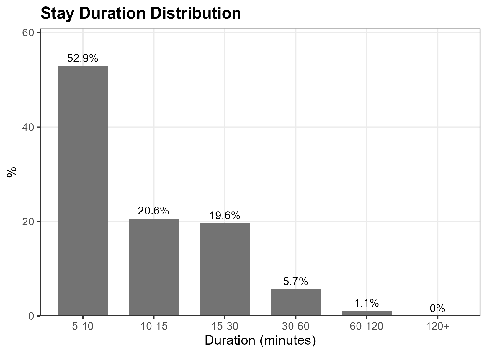
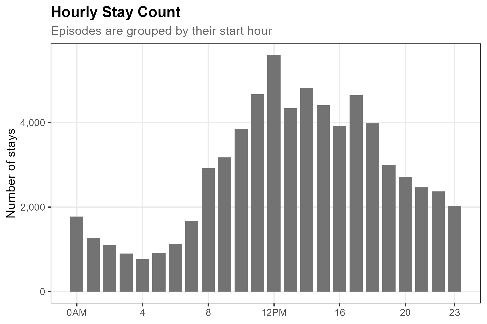
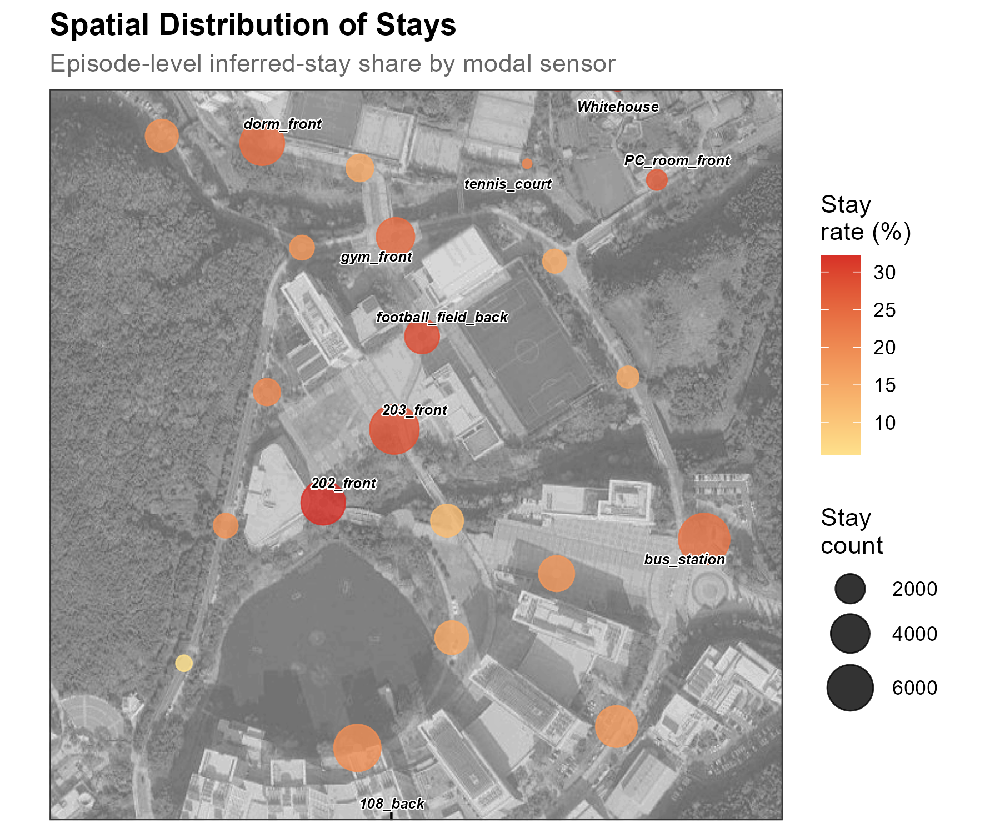
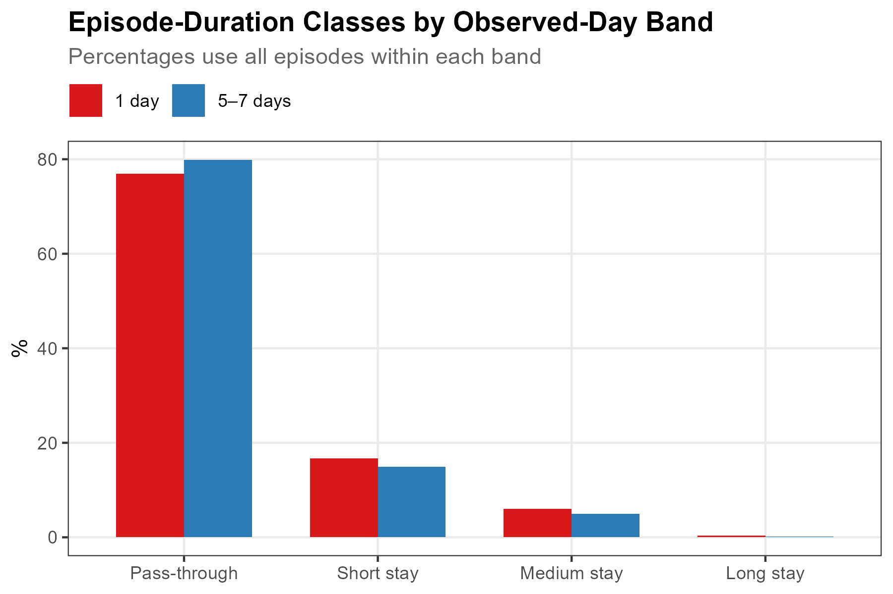

# Activities {#sec-activities}

While [Revisits](4-5-revisits.qmd) summarizes observed-day frequency, Activities identifies **inferred stays** from the spatial and temporal stability of retained observations. After localizing each identifier-window to one sensor and grouping observations into trajectories, the method clusters consecutive positions around an anchor sensor, splits each spatial cluster into continuous detection episodes, and classifies episodes lasting at least 5 minutes as inferred stays.

The operational premise is that **spatial stability over time is compatible with a stationary episode**. The data do not reveal whether a person was studying, dining, socializing, or even whether every retained identifier corresponds one-to-one with a device. Throughout this chapter, “stay” means an episode meeting the stated spatial, continuity, and duration rules. “Pass-through” is the code's label for an episode below the 5-minute threshold; it is not independently verified movement.


## Setup

### Prepare data

Download our sample dataset to follow along, or use your own WiFi detection data: **[sample_main.zip](downloads/sample_main.zip)**. The ZIP contains three files: `wifi.parquet` (WiFi detections), `sensors.gpkg` (sensor locations), and `poi.gpkg` (campus landmarks). Extract the ZIP into a working folder named `sample_main` before running the code below. The sample is a one-week filter of the released campus dataset, with the same pseudonyms and schema, so anything observed here can be followed into the full data. Timestamps are stored in UTC as in the release; the load step converts them once to `Asia/Seoul` so dates and hours follow the local calendar.

::: {.callout-note collapse="true"}
## About the sample dataset

This chapter uses the same UNIST campus dataset introduced in [Count](4-3-count.qmd): see that chapter for the period, sensor coverage, schema, and preparation steps. The downloaded `wifi.parquet` contains 32-character, release- and dataset-specific HMAC-SHA-256 pseudonyms.
:::

### Load packages and data

Load required packages using `pacman::p_load()`, which installs any missing packages automatically:

```{r}
#| label: setup
#| message: false
#| eval: false

pacman::p_load(tidyverse, lubridate, arrow, sf, ggmap, ggrepel, data.table)
```

Load the data files. As in [Track](4-4-track.qmd), we restore the `strength_sum` localization score at load time, and add date/hour columns for later grouping:

```{r}
#| label: load-data
#| eval: false

sample_dir <- "sample_main"  # folder containing the extracted ZIP
wifi_raw <- read_parquet(file.path(sample_dir, "wifi.parquet")) |>
  mutate(
    timestamp = with_tz(timestamp, "Asia/Seoul"),
    strength_sum = 100 * detections + rssi_sum,
    date = as_date(timestamp),
    hour = hour(timestamp)
  )

sensors <- st_read(file.path(sample_dir, "sensors.gpkg"), quiet = TRUE)
```

### Precompute distance matrix

For anchor clustering, we need pairwise distances between all sensors. We transform to a projected CRS (EPSG:5179, Korea TM Central Belt) and compute a 24×24 distance matrix:

```{r}
#| label: distance-matrix
#| eval: false

sensor_sf <- sensors |> st_transform(5179)
dist_mat <- as.numeric(st_distance(sensor_sf))
dist_mat <- matrix(dist_mat, nrow = nrow(sensor_sf),
                   dimnames = list(sensors$sensor_name, sensors$sensor_name))
sensor_idx <- setNames(seq_len(nrow(sensors)), sensors$sensor_name)
```

This gives O(1) distance lookups during the clustering loop, which is critical for performance over ~3 million rows.


## Stay Detection

WiFi detections are processed through a six-step pipeline: localize each detection to its strongest sensor, group into trajectories, filter out low-quality trajectories, cluster spatially stable segments using anchor-based clustering, split clusters into continuous detection episodes, and classify by duration.

```{mermaid}
%%| fig-cap: "Stay detection pipeline"
%%| fig-align: center
%%{init: {'theme': 'base', 'themeVariables': { 'primaryColor': '#e8f4f8', 'primaryTextColor': '#1a1a1a', 'primaryBorderColor': '#5c9ead', 'lineColor': '#5c9ead', 'secondaryColor': '#f0f7e6', 'tertiaryColor': '#fff5e6'}}}%%
flowchart LR
    subgraph PRE["Detection processing"]
        direction TB
        A[WiFi<br/>Detections] --> B[Localize]
        B --> C[Trajectories]
    end

    subgraph SEG["Trajectory screening"]
        direction TB
        D[Quality<br/>Filter] --> E[Anchor<br/>Clustering]
        E --> EP[Episode<br/>Splitting]
    end

    subgraph CLS["Duration classification"]
        direction TB
        F{Duration<br/>>= 5 min?}
        F -->|Yes| G[Stay]
        F -->|No| H[Pass-through]
    end

    PRE --> SEG --> CLS

    style A fill:#e8f4f8,stroke:#5c9ead
    style G fill:#f0f7e6,stroke:#7cb342
    style H fill:#fff5e6,stroke:#f9a825
```

### Parameters

```{r}
#| label: thresholds
#| eval: false

gap_threshold  <- 30     # minutes: trajectory splitting
dist_threshold <- 150    # meters: anchor clustering distance
time_threshold <- 5      # minutes: minimum stay duration
episode_gap    <- 10     # minutes: maximum gap within an episode
min_windows    <- 3      # minimum detections per trajectory
max_duration   <- 7200   # seconds (2 hours): trajectory duration cap
```

::: {.callout-tip collapse="true"}
## Adjusting thresholds

These values suit campus-scale deployments with ~100m sensor spacing:

| Parameter | Default | Range | Notes |
|-----------|---------|-------|-------|
| Distance threshold | 150m | 50–200m | ~sensor detection range |
| Time threshold | 5 min | 3–15 min | Public life study convention |
| Episode gap | 10 min | 5–15 min | Splits clusters with detection gaps [@reinhartBiometeorologicalIndicesExplain2017; @yuanHierarchicalWiFiLog2025] |
| Min detections | 3 | 2–5 | Removes unreliable trajectories |
| Max duration | 2 hours | 1–4 hours | Excludes extended traces from this demonstration |

The anchor clustering algorithm follows Li et al. (2008), who used similar spatial clustering for GPS stay point detection. Kang et al. (2005) used comparable distance thresholds (50–200m) and time thresholds (10–30 min) for WiFi-based place detection.
:::

### Step 1: Localize

Each retained identifier-window may appear at multiple sensors. We select one sensor per `(source_address, timestamp)` using `strength_sum`, the cumulative signal score (`sum(100 + RSSI)` per detection), and break exact score ties alphabetically by `sensor_name`:

```{r}
#| label: localize
#| eval: false

wifi <- wifi_raw |>
  arrange(source_address, timestamp, desc(strength_sum), sensor_name) |>
  distinct(source_address, timestamp, .keep_all = TRUE)
```

```
Raw: 4,231,921 -> Localized: 2,747,285 (64.9%)
```

Localization reduces the data by 35%, keeping exactly one row per retained identifier-window. [Track](4-4-track.qmd) uses the same deterministic localization step.

### Steps 2–3: Trajectories and quality filter

We split each retained identifier's localized observations into trajectories using a 30-minute gap threshold (same as [Track](4-4-track.qmd)), then apply a quality filter:

```{r}
#| label: trajectories
#| eval: false

dt <- as.data.table(wifi)
setorder(dt, source_address, timestamp)

# Trajectory splitting
dt[, time_gap := as.numeric(difftime(timestamp, shift(timestamp), units = "mins")),
   by = source_address]
dt[, new_traj := is.na(time_gap) | time_gap > gap_threshold]
dt[, traj_id := cumsum(new_traj), by = source_address]

# Quality filter: remove sparse or excessively long trajectories
traj_stats <- dt[, .(
  duration_sec = as.numeric(difftime(max(timestamp), min(timestamp), units = "secs")),
  n_windows = .N
), by = .(source_address, traj_id)]

valid_traj <- traj_stats[n_windows >= min_windows & duration_sec <= max_duration]
dt <- dt[valid_traj[, .(source_address, traj_id)], on = .(source_address, traj_id)]
```

::: {.callout-note collapse="true"}
## Why quality filtering matters

Without a duration cap, some trajectories span 6–8 hours. Signal fluctuation can then make the selected sensor change repeatedly across a long trace, producing apparent movement that is difficult to interpret.

The **2-hour maximum** excludes these extended traces. The **3-detection minimum** excludes very sparse trajectories that provide little support for clustering. Both are deployment-specific screening rules rather than evidence about the underlying behavior.
:::

### Step 4: Anchor clustering

Unlike consecutive-distance segmentation (which compares each localized observation only to its predecessor), anchor-based clustering (Li et al., 2008) compares each observation to the cluster's **anchor sensor**: the sensor where the cluster began. A new cluster starts only when the localized sensor lies beyond the distance threshold from the anchor:

```{r}
#| label: anchor-clustering
#| eval: false

addr_vec <- dt$source_address
traj_vec <- dt$traj_id
sidx_vec <- sensor_idx[dt$sensor_name]

n <- nrow(dt)
cluster_ids <- integer(n)
cluster_ids[1] <- 1L
anchor <- sidx_vec[1]
cid <- 1L

for (i in 2:n) {
  if (addr_vec[i] != addr_vec[i-1] || traj_vec[i] != traj_vec[i-1]) {
    anchor <- sidx_vec[i]
    cid <- 1L
  } else if (dist_mat[anchor, sidx_vec[i]] > dist_threshold) {
    cid <- cid + 1L
    anchor <- sidx_vec[i]
  }
  cluster_ids[i] <- cid
}

dt[, cluster_id := cluster_ids]
```

::: {.callout-note collapse="true"}
## How anchor clustering works

Consider one retained identifier localized to sensors A, B, and C:

```
Detection 1: Sensor A             → anchor = A, cluster 1
Detection 2: Sensor B (80m from A) → within 150m of anchor A → cluster 1
Detection 3: Sensor A (0m from A)  → within 150m of anchor A → cluster 1
Detection 4: Sensor C (200m from A)→ exceeds 150m from anchor → cluster 2, anchor = C
Detection 5: Sensor C (0m from C)  → within 150m of anchor C → cluster 2
```

The key advantage is that an identifier alternating between sensors A and B (both within 150m of anchor A) stays in one cluster. This makes the rule less sensitive to sensor-selection fluctuations near coverage boundaries.
:::

### Step 5: Episode splitting

Within each spatial cluster, observations may not be continuous. If the gap between consecutive observations reaches 10 minutes, the cluster is split into separate episodes. Field studies have used sub-10-minute probe intervals as evidence of continuous presence [@reinhartBiometeorologicalIndicesExplain2017], and session-based AP-log work has used the same threshold to merge consecutive detections [@yuanHierarchicalWiFiLog2025]:

```{r}
#| label: episode-split
#| eval: false

dt[, gap_in_cluster := as.numeric(difftime(timestamp, shift(timestamp), units = "mins")),
   by = .(source_address, traj_id, cluster_id)]
dt[, new_episode := is.na(gap_in_cluster) | gap_in_cluster >= episode_gap]
dt[, episode_id := cumsum(new_episode), by = .(source_address, traj_id, cluster_id)]
```

### Step 6: Classify

For each episode, calculate duration and assign the **modal sensor within that episode** as its primary sensor. This is recomputed after continuity splitting; it is not necessarily the spatial cluster's anchor. Episodes lasting at least 5 minutes are classified as inferred stays and further subdivided by duration:

```{r}
#| label: classify-stays
#| eval: false

stays <- dt[, .(
  start_time = min(timestamp),
  end_time = max(timestamp),
  duration_mins = as.numeric(difftime(max(timestamp), min(timestamp), units = "mins")),
  n_detections = .N,
  primary_sensor = names(which.max(table(sensor_name))),
  n_sensors = uniqueN(sensor_name),
  date = as_date(min(timestamp)),
  hour = hour(min(timestamp))
), by = .(source_address, traj_id, cluster_id, episode_id)]

stays[, `:=`(
  is_stay = duration_mins >= time_threshold,
  activity_type = factor(
    fcase(
      duration_mins < time_threshold, "Pass-through",
      duration_mins < 15, "Short stay",
      duration_mins < 60, "Medium stay",
      default = "Long stay"
    ),
    levels = c("Pass-through", "Short stay", "Medium stay", "Long stay")
  )
)]

stays <- as_tibble(stays)
```

```
Stay detection results:
  Total episodes: 334,081
  Stays (>= 5 min): 68,385 (20.5%)
  Median stay duration: 9.3 mins
```

Of roughly 334,000 episodes, about 20% meet the inferred-stay rule: localized observations remained in the spatial cluster for at least 5 minutes without a detection gap of 10 minutes or more. Episode splitting prevents separated bursts from being treated as one continuous interval.


## Observed Episode Patterns

### Episode-duration class distribution

Most episodes (79.5%) fall below the 5-minute inferred-stay threshold and are labeled `Pass-through` in the code. Short inferred stays (5–15 min) account for 15.1% of all episodes, followed by medium stays (5.2%) and long stays (0.2%).


::: {.callout-note collapse="true"}
## Show code

```r
activity_dist <- stays |>
  count(activity_type) |>
  mutate(pct = n / sum(n) * 100)

ggplot(activity_dist, aes(activity_type, pct, fill = activity_type)) +
  geom_col(width = 0.7) +
  geom_text(aes(label = paste0(round(pct, 1), "%")),
            vjust = -0.5, fontface = "bold", size = 3.5) +
  scale_fill_manual(values = c("Pass-through" = "gray55",
                               "Short stay" = "#fdae61",
                               "Medium stay" = "#f46d43",
                               "Long stay" = "#d73027")) +
  scale_y_continuous(expand = expansion(mult = c(0, 0.15))) +
  labs(title = "Episode-Duration Class Distribution",
       x = NULL, y = "%") +
  theme_bw() +
  theme(legend.position = "none")
```
:::

### Stay duration distribution

Among inferred stays, the distribution peaks at 5–10 minutes (52.9%), followed by 10–15 minutes (20.6%) and 15–30 minutes (19.6%). The 2-hour trajectory screen limits the contribution of extended traces. About 1% of inferred stays fall in the 60–120 minute range; the WiFi observations do not identify the activity associated with those intervals.



::: {.callout-note collapse="true"}
## Show code

```r
stays_only <- stays |> filter(is_stay)

duration_bins <- stays_only |>
  mutate(duration_bin = cut(duration_mins,
                            breaks = c(5, 10, 15, 30, 60, 120, Inf),
                            labels = c("5-10", "10-15", "15-30", "30-60", "60-120", "120+"),
                            right = FALSE)) |>
  count(duration_bin) |>
  mutate(pct = n / sum(n) * 100)

ggplot(duration_bins, aes(duration_bin, pct)) +
  geom_col(fill = "gray45", width = 0.7) +
  geom_text(aes(label = paste0(round(pct, 1), "%")),
            vjust = -0.5, size = 3.2) +
  scale_y_continuous(expand = expansion(mult = c(0, 0.15))) +
  labs(title = "Stay Duration Distribution",
       x = "Duration (minutes)", y = "%") +
  theme_bw()
```
:::

### Temporal pattern

Inferred-stay counts peak near noon at around 5,600 episodes and remain comparatively high through the afternoon. Counts fall to about 760 at 4 AM. These are episode counts, not counts of people or independent activities.



::: {.callout-note collapse="true"}
## Show code

```r
hourly_stays <- stays |>
  group_by(hour) |>
  summarise(
    n_total = n(),
    n_stays = sum(is_stay),
    stay_rate = mean(is_stay) * 100,
    .groups = "drop"
  )

ggplot(hourly_stays, aes(hour, n_stays)) +
  geom_col(fill = "gray45", width = 0.8) +
  scale_x_continuous(breaks = c(0, 4, 8, 12, 16, 20, 23),
                     labels = c("0AM", "4", "8", "12PM", "16", "20", "23")) +
  scale_y_continuous(labels = scales::comma) +
  labs(title = "Hourly Stay Count",
       subtitle = "Episodes are grouped by their start hour",
       x = NULL, y = "Number of stays") +
  theme_bw()
```
:::

::: {.callout-note collapse="true"}
## Inferred-stay share has a different denominator

While inferred-stay *count* peaks sharply at midday, the episode-level inferred-stay share (`inferred-stay episodes / all episodes`) ranges from about 18% to 26% across hours. The count and share therefore answer different questions. The WiFi data alone do not establish why the share is lowest near 8 AM and highest near 5 AM.
:::

### Spatial pattern

Episode-level inferred-stay shares differ by primary sensor. The largest observed shares are about 27–32%, and the smallest about 6–15%. Each episode contributes once, to its modal sensor.



::: {.callout-note collapse="true"}
## Show code

```r
sensor_activity <- stays |>
  group_by(primary_sensor) |>
  summarise(
    n_clusters = n(),
    n_stays = sum(is_stay),
    stay_rate = mean(is_stay) * 100,
    avg_duration = mean(duration_mins[is_stay], na.rm = TRUE),
    .groups = "drop"
  ) |>
  left_join(sensor_coords, by = c("primary_sensor" = "sensor_name"))

ggmap(base_map, darken = c(0.3, "white")) +
  geom_point(data = sensor_coords, aes(x = X, y = Y),
             size = 1.2, color = "grey60", inherit.aes = FALSE) +
  geom_point(data = sensor_activity,
             aes(x = X, y = Y, size = n_stays, color = stay_rate),
             alpha = 0.8, inherit.aes = FALSE) +
  scale_size_continuous(range = c(1.5, 10), name = "Stay\ncount") +
  scale_color_gradient(low = "#fee08b", high = "#d73027", name = "Stay\nrate (%)") +
  labs(title = "Spatial Distribution of Stays") +
  theme_bw()
```
:::

::: {.callout-note collapse="true"}
## Reading the spatial pattern

The largest shares occur at `202_front` (32%, mean inferred-stay duration 16 min), `Whitehouse` (30%, 19 min), `football_field_back` (29%, 16 min), and `203_front` (28%, 14 min). `dorm_front` (24%, 12 min), `gym_front` (24%, 16 min), and `bus_station` (23%, 13 min) fall in the middle. The smallest include `202_back_further` (6%, 10 min), `bridge_main_engineer` (12%, 11 min), and `lake` (15%, 12 min). These values describe episodes assigned to sensors; inferring location function requires separate site evidence.
:::

### By observed-day band

Linking episodes to the [Revisits](4-5-revisits.qmd) bands shows an episode-level inferred-stay share of 23.1% for identifiers observed on 1 day and 20.1% for those observed on 5–7 days. Median inferred-stay duration is 9.7 versus 9.3 minutes. Medium stays make up 6.1% versus 5.0% of episodes, while below-threshold episodes account for 76.9% versus 79.9%.



::: {.callout-note collapse="true"}
## Show code

```r
# Classify retained identifiers by observed-day frequency
high_frequency_threshold <- 5

identifier_days <- wifi |>
  group_by(source_address) |>
  summarise(n_days = n_distinct(date), .groups = "drop") |>
  mutate(observed_day_band = factor(
    case_when(
      n_days == 1 ~ "1 day",
      n_days >= high_frequency_threshold ~ "5–7 days",
      TRUE ~ "2–4 days"
    ),
    levels = c("1 day", "2–4 days", "5–7 days")
  ))

# Join the two extreme bands to episodes
stays_with_band <- stays |>
  left_join(identifier_days |> select(source_address, observed_day_band),
            by = "source_address") |>
  filter(observed_day_band %in% c("1 day", "5–7 days"))

# Episode-duration distribution by observed-day band
activity_by_band <- stays_with_band |>
  count(observed_day_band, activity_type) |>
  group_by(observed_day_band) |>
  mutate(pct = n / sum(n) * 100) |>
  ungroup()

ggplot(activity_by_band,
       aes(activity_type, pct, fill = observed_day_band)) +
  geom_col(position = "dodge", width = 0.7) +
  scale_fill_manual(values = c("1 day" = "#d7191c", "5–7 days" = "#2c7bb6"),
                    name = NULL) +
  labs(title = "Episode-Duration Classes by Observed-Day Band",
       x = NULL, y = "%") +
  theme_bw() +
  theme(legend.position = "top")
```
:::

::: {.callout-note collapse="true"}
## Denominator and interpretation

The percentages above use **episodes** as their denominator. The difference between the two bands is modest and descriptive; the data do not establish the reason for it.

This campus quantity is not the same as the commercial case-study ratio. The commercial demonstration flags each distinct trajectory–sensor pair when at least one inferred-stay episode maps to that sensor, then divides flagged pairs by all trajectory–sensor pairs. Report the unit and denominator rather than comparing the two percentages directly.
:::


