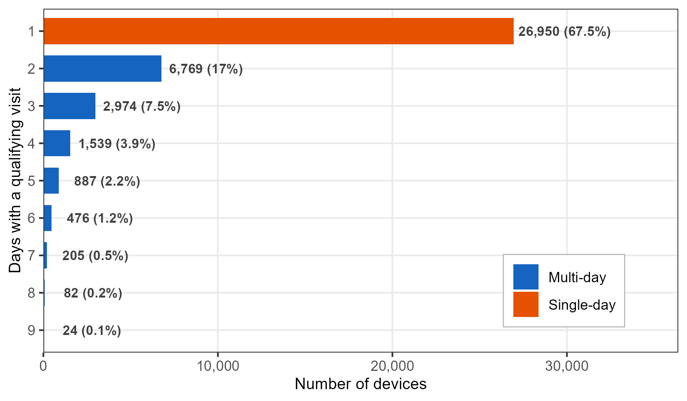

# Pedestrian Activity in a Commercial District {#sec-casestudy-uou}

The preceding chapters demonstrated the five metrics on a university campus. This case study applies two of them, Activities and Revisits, to a commercial district with both pedestrian-priority and conventional streets. The question is: **where are inferred stays observed, and does the pattern differ between retained identifiers observed on one qualifying day and those observed on multiple qualifying days?**

The figure below summarizes the main findings.


The inferred-stay ratio, the share of trajectory–sensor pairs at which at least one inferred stay occurred, is 13.1% on pedestrian-priority streets and 6.1% on conventional streets. Sensor-level distributions overlap, but the aggregate contrast appears in both observation-day bands and is larger for single-day-observed identifiers (+8.4 pp) than for multi-day-observed identifiers (+6.2 pp).

The rest of this chapter walks through the analytical steps behind this figure.


## Study site

The study site is a commercial district near the University of Ulsan, South Korea. A designated pedestrian-priority street (~400 m) runs north--south through the district core, flanked by conventional streets with mixed vehicle and pedestrian traffic. The pedestrian-priority street hosts restaurants and small retail shops; the surrounding streets serve similar functions but without vehicle restrictions.

Seventeen WiFi sensors were deployed across the district over 9 valid days (July 2020): eight on the pedestrian-priority street and nine on conventional streets. At 20-second resolution, the dataset contains approximately 5.4 million sensor-level records from over 75,000 unique retained source identifiers.

::: {.callout-note collapse="true"}
## Data preparation

The district dataset ships with this repository. The WiFi windows (`data/release-20sec/wifi_uou20_20sec.parquet`) use the toolkit's common release format: one row per retained identifier, sensor, and 20-second window, with the same schema as the campus dataset (`timestamp`, `source_address`, `sensor_name`, `rssi_median`, `rssi_sum`, `detections`). The `strength_sum` localization score is not shipped and is restored at load time as `100 * detections + rssi_sum`, the toolkit's convention for public files. Sensor locations and street-type labels are in `workflow/uou20/output/sensors_coords.csv`, and the bus-stop overlay in `workflow/uou20/data/poi_uou.gpkg` marks transit access points. The full analysis is in `scripts/9-2-figure3.R`. The file's identifiers are release-specific pseudonyms assigned downstream when the release was built; this does not imply that the maintained collector was used in 2020.
:::


## Data pipeline

The stay detection pipeline follows the same logic as @sec-activities (localize, build trajectories, cluster spatially, split into detection episodes, classify by duration), but with parameters adapted for the denser sensor network in this commercial district.

### Localization

The distributed dataset is already aggregated into 20-second windows. Within each identifier-window, the sensor with the highest cumulative signal score (`strength_sum`, the sum of `100 + RSSI` over the window's detections) is selected as the observed location. Exact ties are resolved by sensor name, so results do not depend on file row order.

### Valid days and overnight-observation screen

Days with insufficient sensor uptime are excluded, leaving 9 valid days. Identifiers observed from 0–4 AM on 3 or more days are then excluded by an operational overnight-observation screen. This reduces repeated signals plausibly originating from nearby dwellings, but it does not verify residence.

```{r}
#| label: overnight-observation-filter
#| eval: false

overnight_identifiers <- wifi |>
  filter(hour(timestamp) %in% 0:4) |>
  distinct(source_address, date) |>
  count(source_address, name = "night_days") |>
  filter(night_days >= 3) |>
  pull(source_address)

wifi <- wifi |> filter(!source_address %in% overnight_identifiers)
```

### Trajectories and quality filter

Localized observations are grouped into trajectories using a 2-hour gap threshold: after more than 2 hours without an observation, a new trajectory begins. This longer gap allows interruptions in street-level detection without automatically ending the sequence. A quality filter retains only trajectories with at least 2 sensors and between 1 minute and 2 hours of duration, yielding 73,809 qualifying trajectories from 39,906 retained identifiers.

### Anchor clustering

Sensor spacing in this district is much tighter (46--95 m nearest-neighbor, median ~50 m) than on campus (63--147 m), so the distance threshold is lowered to 75 m, just above the typical nearest-neighbor spacing. Switching between adjacent sensors stays within one cluster, while a localized observation beyond the threshold starts a new one.

::: {.callout-tip collapse="true"}
## Why 75 m instead of 150 m?

The campus deployment (@sec-activities) used 150 m, just above its widest nearest-neighbor spacing (~147 m) and on the order of the sensor detection range. Here, nearest-neighbor distances run from 46 m to 95 m, with most sensors within about 63 m of their nearest neighbor. Setting $\theta_d$ at 75 m means:

- Two adjacent sensors ($\leq$75 m) merge: ping-ponging resolved
- Non-adjacent sensors (>75 m) break: a new spatial cluster starts

A higher threshold (e.g., 100 m) would merge a wider range of localized sequences and reduce the number of spatial breaks.
:::

### Detection episodes and stay classification

A spatial cluster can span long silences: two probe bursts an hour apart would otherwise count as one continuous presence. Each cluster is therefore split into detection episodes wherever the gap between consecutive detections reaches 10 minutes, a continuity value consistent with observed probe-request intervals in pedestrian studies [@reinhartBiometeorologicalIndicesExplain2017; @yuanHierarchicalWiFiLog2025]. Episodes lasting 5 or more minutes are classified as inferred stays, following the public life study convention [@gehlHowStudyPublic2013]. Each episode is assigned to its primary sensor, the sensor with the most detections within the episode.


## Street type comparison

Pedestrian-priority sensors have an inferred-stay ratio of 13.1% across all trajectory–sensor pairs, compared with 6.1% on conventional streets.

```{r}
#| label: street-comparison
#| eval: false

type_result <- traj_sensor |>
  mutate(street_type = recode(street_type, "Regular" = "Conventional")) |>
  group_by(street_type) |>
  summarise(
    n_traj_sensor = n(),
    n_stay        = sum(is_stay),
    stay_rate     = round(mean(is_stay) * 100, 1),
    n_identifiers = n_distinct(source_address),
    .groups = "drop"
  )
```

```
  street_type  n_traj_sensor  n_stay  stay_rate  n_identifiers
  Pedestrian          65,168   8,529       13.1     23,274
  Conventional       178,067  10,782        6.1     37,621
```

The contrast also appears at the individual sensor level (panel b). Grouped by street type, pedestrian-priority sensors (median 11.7%) sit above conventional sensors (median 5.9%), though the distributions overlap: one conventional sensor (u16, 12.1%) exceeds the pedestrian-priority median.


## Qualifying observation-day classification

The street-type comparison shows where inferred-stay episodes are assigned, but not how the ratio relates to observation-day frequency. To examine that dimension, we classify retained identifiers by the number of qualifying observation days and compare ratios within each band.

### Distribution of qualifying observation days

Retained identifiers are classified by the number of distinct dates with at least one qualifying trajectory, so the classification shares its population with the stay analysis (39,906 identifiers). A date with only a stray detection and no qualifying trajectory does not count as an observation day here.



Most retained identifiers (67.5%) have a qualifying trajectory on exactly one day, and the count drops sharply at day 2 (17.0%). This motivates a binary split rather than the three observation-frequency bands used in the campus tutorial (@sec-revisits): **Single-day observed** (1 day; 26,950 identifiers, 67.5%) and **Multi-day observed** (2+ days; 12,956 identifiers, 32.5%).

```{r}
#| label: freq-classify
#| eval: false

visit_freq <- traj_summary |>
  distinct(source_address, date) |>
  count(source_address, name = "n_days") |>
  mutate(visit_type = if_else(
    n_days == 1L, "Single-day observed", "Multi-day observed"
  ))
```

::: {.callout-note collapse="true"}
## Why a binary split, and what the labels mean

The campus tutorial uses three directly observed bands over a 7-day window (1 day, 2--4 days, and 5--7 days; @sec-revisits). This commercial-district distribution drops much more sharply after day 1, so the useful descriptive boundary is between one qualifying observation day and more than one.

The labels describe repeated observations of a retained pseudonymous identifier within the nine-day deployment, not an intrinsic visitor type or a verified number of visits by a person. Removing locally administered addresses reduces one source of rotation but also excludes part of the observable address stream (22.3% of detections at this site; @sec-rand-validation). A person may carry multiple devices, a device may expose different addresses, and some visits may produce no qualifying trajectory.
:::


## Observation-day band by street type

With identifiers classified into the two bands, panel (c) compares the street-type contrast within each band. Single-day-observed identifiers have an inferred-stay ratio of 5.9% on conventional streets and 14.3% on pedestrian-priority streets, a difference of +8.4 percentage points. Multi-day-observed identifiers shift from 6.1% to 12.3% (+6.2 pp).

```{r}
#| label: cross-analysis
#| eval: false

traj_sensor_freq <- traj_sensor |>
  inner_join(visit_freq |> select(source_address, visit_type),
             by = "source_address")

freq_cross <- traj_sensor_freq |>
  group_by(visit_type, street_type) |>
  summarise(
    n_traj_sensor = n(),
    n_stay        = sum(is_stay),
    stay_rate     = round(mean(is_stay) * 100, 1),
    n_identifiers = n_distinct(source_address),
    .groups = "drop"
  )
```

The pedestrian-priority contrast appears in both bands and is larger for single-day-observed identifiers (+8.4 pp vs. +6.2 pp). On conventional streets, the two ratios are similar (5.9% and 6.1%); on the pedestrian-priority street, they differ by 2.0 percentage points (14.3% and 12.3%).

::: {.callout-note collapse="true"}
## Interpreting the difference

Lingering is an optional activity that can arise when the surrounding environment is supportive [@gehlHowStudyPublic2013]. The observed pattern is compatible with that reading because the aggregate inferred-stay ratio is higher on the pedestrian-priority street in both bands. Whether street design *causes* the difference cannot be settled by this observational comparison: identifier composition, shop mix, street function, sensor placement, and detection conditions may also differ, and the labels describe only nine qualifying observation days.
:::


## Notes

The inferred-stay ratio counts each distinct trajectory–sensor pair once, flagging the pair when at least one inferred-stay episode maps to that sensor. It therefore differs both from the campus chapter's episode-level share and from a timeslot-based approach used with coarser data. The 20-second windows preserve observation order for trajectory construction and spatial clustering, helping reduce sensor-switching artifacts that coarser aggregation can obscure.

The observation-day classification relies on source identifiers remaining stable within the deployment. Preprocessing removes all locally administered addresses (@sec-cleaning), which includes randomized addresses but can also exclude persistent per-network private addresses. The trajectory quality filter (at least 2 sensors, 1–120 minutes) further restricts which days count. The public 20-second file carries release-specific pseudonyms that preserve equality only within this dataset without exposing the historical internal identifiers; this downstream replacement is not a claim about the 2020 collector.

This analysis extends @sec-activities by adding a second descriptive dimension. Episode classification identifies where inferred stays are assigned; the qualifying observation-day bands (@sec-revisits) show that the street-type contrast is present in both bands. The full analysis code is available in `scripts/9-2-figure3.R`.
