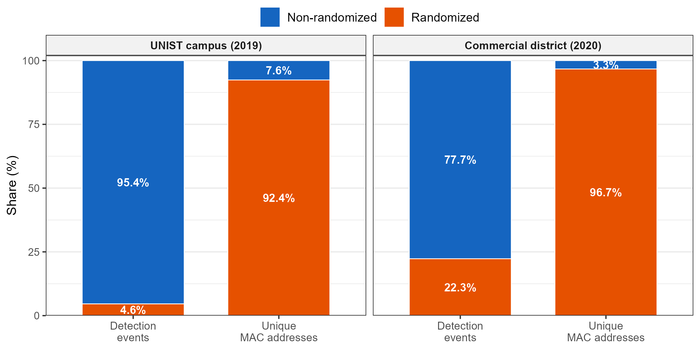
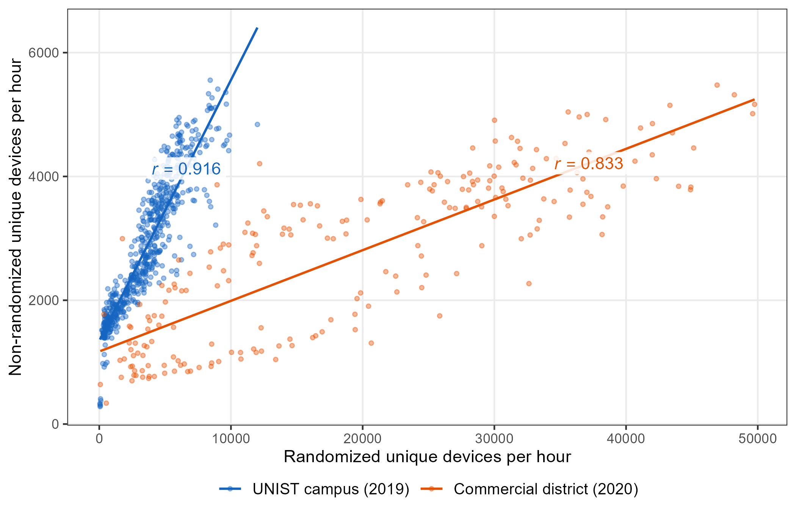
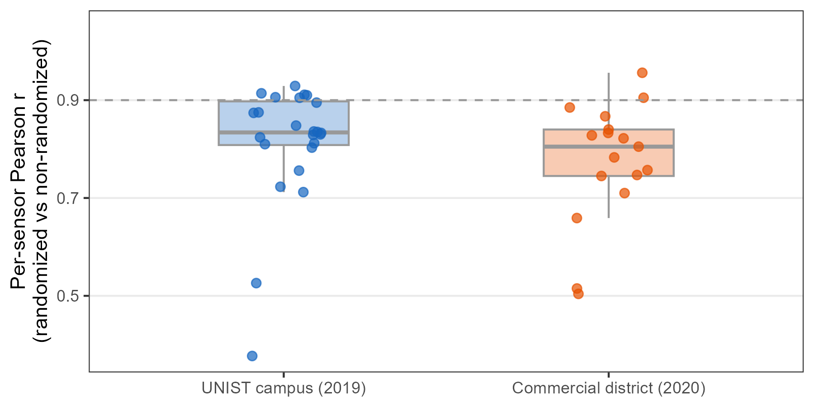

# MAC Address Randomization {#sec-randomization}

This appendix examines MAC address randomization, the principal constraint on WiFi-based pedestrian sensing. It explains how platform behavior has changed, tests whether the retained and removed address streams co-vary in five deployments, and states what each metric can and cannot support under the toolkit's conservative filtering policy.


## How Randomization Has Evolved

MAC address randomization replaces a hardware or manufacturer-assigned source address with a locally administered private address. Its implementation has progressed through three broad phases since 2014.

::: {.callout-note collapse="true"}
## What is MAC address randomization?

WiFi sensing begins with source addresses carried in observed frames. The maintained collector evaluates the locally administered bit and converts each observed source address to a 32-character, deployment-scoped HMAC-SHA-256 pseudonym before storage. If the same observed address recurs, its HMAC pseudonym remains consistent within that deployment; this does not identify a person. Device-side randomization can change the source address before the collector sees it, so the resulting observation streams cannot be assumed to represent unique devices.

```
  Stable observed address           Changing private addresses

     Device A                           Device A
       │                                 │
       ├── A1 ──→ Sensor                  ├── X1 ──→ Sensor
       ├── A1 ──→                         ├── X2 ──→
       └── A1 ──→                         └── X3 ──→

     1 observed address stream         3 observed address streams
     (not a person count)              (not three verified devices)
```
:::

### Early adoption (2014--2018)

Apple introduced randomized source addresses for unassociated WiFi scanning in iOS 8 (2014). Android 6.0 (2015) documented randomized source addresses for background scans, with more systematic disconnected-scan randomization implemented in later releases ([Apple WWDC20](https://developer.apple.com/videos/play/wwdc2020/10676/?time=303); [Android 6.0 changes](https://developer.android.com/about/versions/marshmallow/android-6.0-changes); [AOSP implementation history](https://source.android.com/docs/core/connect/wifi-mac-randomization)). In practice, early implementations were incomplete and varied by manufacturer. A large-scale measurement study found that over 96% of tested Android phones did not effectively randomize during this period [@martinStudyMACAddress2017]. Even when randomization was active, other frame information could still support linkage [@vanhoefWhyMACAddress2016].

### Transition to default-on (2019--2021)

The transition to connection-time randomization came with Android 10 (released in 2019), which enabled MAC randomization by default in WiFi client mode, and iOS 14 (released in 2020), which introduced per-network Private Wi-Fi Address and enabled it by default ([Android 10 release notes](https://source.android.com/docs/whatsnew/android-10-release); [Apple Private Wi-Fi Address](https://support.apple.com/102509)). These changes extended randomization beyond earlier background or unassociated scanning; they did not make every WiFi frame or scan randomized.

However, adoption remained uneven. A follow-up study testing 160 phone models from 18 manufacturers found that while recent devices approached effective randomization, manufacturer fragmentation (particularly among budget Android phones that never receive OS updates) left significant gaps [@fenskeThreeYearsLater2021].

### Current state (2022--present) {#sec-rand-current}

In iOS 18, Private Wi-Fi Address has three per-network modes: Off uses the hardware address; Fixed uses a nonrotating private address and is the default for new WPA2-or-stronger networks; Rotating changes the private address every two weeks and is the default for new weak-security or open networks ([Apple support](https://support.apple.com/102509)). AOSP documents persistent per-network randomization as the default association mode in Android 10 and later, while Android 12 and later can use non-persistent randomization in specified cases ([AOSP behavior](https://source.android.com/docs/core/connect/wifi-mac-randomization-behavior)). The Android 15 compatibility definition requires randomization for disconnected scans and strongly recommends it for associated communication ([Android 15 CDD](https://source.android.com/docs/compatibility/15/android-15-cdd)). IEEE 802.11bh-2024 provides service-continuity mechanisms for stations using randomized or changing addresses; it does not mandate operating-system randomization ([IEEE 802.11bh-2024](https://standards.ieee.org/ieee/802.11bh/10525/)).

The five-deployment record in @sec-rand-snapshot shows how this transition appears in the study data; it does not treat the five sites as a time series.

## Addressing Randomization {#sec-rand-measurement}

Platform behavior depends on association state, network security, device settings, and OS version. Saving a network does not guarantee a fixed address: current platforms normally use a locally administered private address for that association, and its persistence depends on the selected mode. Unassociated scan traffic also uses randomized source addresses, but rotation cadence is platform-specific ([Apple scan privacy](https://support.apple.com/guide/security/secb9cb3140c/web); [Android 15 CDD](https://source.android.com/docs/compatibility/15/android-15-cdd)).

The maintained collector evaluates the locally administered bit **before** 32-character, deployment-scoped HMAC-SHA-256 pseudonymization and stores the result as a flag. Preprocessing then removes flagged rows (@sec-cleaning). This is a conservative proxy: a set bit is not proof of how an address was generated. Stable or Fixed per-network private addresses still carry the locally administered bit, so the maintained pipeline removes them even if the operating system would keep them consistent. Having a saved local network therefore does not, by itself, make Track, Activities, or Revisits feasible under the maintained policy.

The historical 2019--2020 validation applied the same bit classification within its original restricted pipeline, not the maintained collector. The question tested below is narrower: after removing flagged rows, do hourly counts in the retained stream co-vary with the removed stream in these deployments?


## Empirical Validation {#sec-rand-validation}

We examine the filtering approach using two deployments collected during the transition period: the UNIST campus (24 sensors, October--November 2019) and a commercial district near the University of Ulsan (17 sensors, July 2020). For each hour, we independently count unique source addresses in the locally administered and non-locally-administered streams. The streams share no addresses. Correlation therefore measures temporal co-variation between two address streams, not device-level agreement or population representativeness.


### Randomization rates at two levels {#sec-rand-landscape}

Randomization rates differed substantially between the two sites, but the gap between detection-level and MAC-level percentages was consistently large.

At the UNIST campus, locally administered addresses account for 4.8% of detection events but 92.4% of unique observed source addresses, a 19$\times$ ratio between the two percentages. In the commercial district, the detection-level share is 22.3% and the address-level share is 96.7%, a 4.3$\times$ ratio. Address rotation inflates unique-address counts, so an address-level percentage must not be interpreted as a device-level randomization rate. Invalid capture artifacts (all-zero or malformed addresses) are excluded from both levels.

These diagnostic percentages are computed from restricted pre-pseudonymization address fields because the locally administered bit cannot be recovered from a pseudonym. Public 20-second files contain only 32-character, release- and dataset-specific HMAC-SHA-256 pseudonyms.

{#fig-rand-landscape}


### Temporal co-variation {#sec-rand-temporal}

If the retained stream captures the same broad temporal rhythm as the removed stream, their hourly address counts should rise and fall together. @fig-rand-temporal plots the hourly unique-address count for each stream across both sites. Because no address appears in both groups, correlation reflects shared timing in the two streams; it does not show that their users or devices are compositionally equivalent.

The relationship is strong at both sites: $r$ = 0.916 at the UNIST campus (624 hours) and $r$ = 0.833 in the commercial district (222 hours). The commercial district also has a larger locally administered detection share (22.3% versus 4.8%) and a noisier randomized-address count. These site-level associations support relative temporal analysis in these datasets but do not establish an unbiased retained sample.

{#fig-rand-temporal}


### Generalization across sensor locations {#sec-rand-spatial}

The temporal co-variation holds not only in site-level aggregates but at individual sensor locations. We computed the same hourly correlation separately for each sensor, yielding 41 per-sensor Pearson $r$ values (24 from the UNIST campus, 17 from the commercial district). @fig-rand-spatial summarizes their distribution.

The UNIST campus shows a median per-sensor $r$ of 0.834 (IQR: 0.808--0.897); the commercial district shows a median of 0.805 (IQR: 0.745--0.840). Most sensors cluster above $r$ = 0.7, showing that temporal co-variation occurs at many locations within these two deployments. This within-site pattern is not evidence of external generalizability.

{#fig-rand-spatial}

Four sensors show notably lower correlations (sensor names as mapped in @sec-deployment). At the UNIST *Whitehouse* sensor ($r$ = 0.378), 21% of hours contain no locally administered address, while other hours contain sharp spikes. The *tennis_court* sensor ($r$ = 0.527) also has many near-zero hours. Sparse and zero-heavy hourly series make both correlations unstable; the data do not establish the activities that produced those series.

In the commercial district, *u02* ($r$ = 0.504) and *u13* ($r$ = 0.515) present a different pattern. Both are positioned on the pedestrian-priority street (@sec-deploy-uou) and record substantial hourly address counts. At *u13*, the locally administered stream averages 1,798 unique addresses per hour and the retained stream 285, a 6.3:1 ratio. The streams therefore sample very different address mixtures at this sensor; the data do not identify the people or device roles behind that difference.

These outliers define where the co-variation check is weak. Sparse hours and stream imbalance should be reported rather than attributed to particular visitor types.


### Boundaries

In these two deployments, hourly counts in the retained stream preserve the broad temporal rhythm of the locally administered stream. This finding supports relative comparisons in the retained data, but not absolute person counts or a claim that the retained addresses represent all visitors. The campus analysis contains approximately 25,600 retained source identifiers over 26 days after preprocessing. Whether that is sufficient for a metric is a deployment-specific empirical question.


## Implications for the Five Metrics {#sec-rand-metrics}

Randomization does not affect the toolkit's five metrics equally. Feasibility depends on the observed address stream, platform and association behavior, filtering policy, detection continuity, and the metric's required persistence window. A saved local network is not sufficient under the maintained filter because private association addresses are locally administered and removed.

**Location** compares sensor support within one time window. It requires no cross-day persistence, but it still describes only the retained observation stream.

**Count** can describe relative temporal and spatial patterns when the deployment-specific co-variation check supports that use. At the two sites, retained and removed hourly address counts rose and fell together ($r$ = 0.916 and 0.833). The retained count is not a person count or a guaranteed lower bound; absolute pedestrian estimates require independent calibration.

**Track** and **Activities** require the same retained address to persist over a trajectory or episode. The maintained policy computes both only from rows that pass the locally administered-bit filter. Fixed or persistent per-network private addresses can provide operating-system continuity, but they remain locally administered and are removed by this preprocessing. A separately governed extension could evaluate retaining such addresses, but that is not the default toolkit implemented here.

**Revisits** is the most constrained metric because the same retained address must recur across qualifying observation days. Under the maintained policy, a saved network is insufficient: current iOS and Android normally use a locally administered private address for that association, which the toolkit removes. The commercial-district demonstration (@sec-casestudy-uou) is a bounded analysis of retained 2020 addresses. A new deployment should use Revisits only when enough persistent, non-flagged identifiers remain and the observation-day definition is reported explicitly.

No site type guarantees that all five metrics are feasible. Every deployment should report locally administered shares at both the detection and unique-address levels, examine co-variation and outliers, disclose the filtering policy, and collect independent pedestrian counts when absolute estimates are needed. When persistence is insufficient, limit the analysis to the relative aggregate patterns that the retained sample can support.
