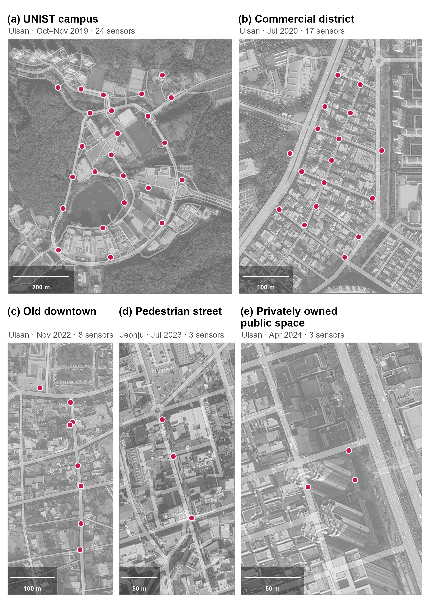

# Five Deployments Across the Randomization Transition (2019--2024) {#sec-rand-snapshot}

The validation in @sec-rand-validation uses data from 2019 and 2020, collected while the default-on transition was underway. This appendix records how the same quantities look under current operating systems: we recomputed the randomization statistics for three later deployments by the authors, the last collected when iOS 17 and Android 14 were current. Randomized addresses are identified by the locally administered bit of the MAC address (in 2024, by an equivalent flag recorded at capture). All five rows are computed the same way as the demonstration datasets: device-originated records within the sensors' effective signal range, aggregated to one record per device, sensor, and second. Malformed capture artifacts (all-zero or non-address strings) are excluded before classification, since they would otherwise pass the locally administered bit test as non-randomized devices. These raw captures are restricted inputs and are not included in the public package; this retrospective comparison does not claim that the maintained deployment-scoped HMAC collector was used in any of the five deployments.

```{=html}
<table class="rand-table">
  <caption><span class="tbl-label">Table&nbsp;C.1.</span> MAC address randomization across five deployments by the authors.</caption>
  <thead>
    <tr>
      <th style="text-align:left; width:38%">Deployment</th>
      <th style="text-align:right; white-space:normal">Randomized detections<sup>1</sup></th>
      <th style="text-align:right; white-space:normal">Randomized addresses<sup>2</sup></th>
      <th style="text-align:right; white-space:normal">Non-randomized addresses<sup>3</sup></th>
    </tr>
  </thead>
  <tbody>
    <tr><td style="text-align:left">UNIST campus, Ulsan (2019)</td><td style="text-align:right">4.8%</td><td style="text-align:right">92.4%</td><td style="text-align:right">176,554</td></tr>
    <tr><td style="text-align:left">Commercial district near the University of Ulsan (2020)</td><td style="text-align:right">22.3%</td><td style="text-align:right">96.7%</td><td style="text-align:right">144,967</td></tr>
    <tr><td style="text-align:left">Old-downtown commercial district, Ulsan (2022)</td><td style="text-align:right">44.3%</td><td style="text-align:right">97.7%</td><td style="text-align:right">14,328</td></tr>
    <tr><td style="text-align:left">Pedestrian shopping street, Jeonju (2023)</td><td style="text-align:right">45.4%</td><td style="text-align:right">97.1%</td><td style="text-align:right">1,560</td></tr>
    <tr><td style="text-align:left">Privately owned public space, Ulsan (2024)</td><td style="text-align:right">39.4%</td><td style="text-align:right">96.0%</td><td style="text-align:right">5,834</td></tr>
  </tbody>
  <tfoot>
    <tr>
      <td colspan="4" class="rand-notes">
        <sup>1</sup> Share of detections broadcasting a randomized address; each device-sensor-second record counts as one detection.
        <sup>2</sup> Share of unique observed source addresses that are randomized.
        <sup>3</sup> Count of unique non-randomized source addresses; reflects each deployment's duration and extent (from 26 days to a 19-hour window) and is not comparable across sites. Counts are derived from the raw captures before the toolkit's preprocessing (stationary-identifier and minimum-detection filtering) and therefore exceed the analysis-dataset counts in Appendix A. Deployment details are given in Table&nbsp;C.2.
      </td>
    </tr>
  </tfoot>
</table>
```

These are opportunistic snapshots of different sites, populations, durations, and capture windows, not a time series. Two patterns recur. First, the randomized share is high at the address level: 92.4% in 2019 and between 96% and 98% in the four later deployments. Independent longitudinal measurements likewise report an increase from 40% to 94% between 2016 and 2020 [@ribeiroPassiveWiFiMonitoring2022]. Second, each deployment still contains non-randomized source addresses, from 176,554 over the 26-day campus deployment to 1,560 within a 19-hour window in Jeonju, consistent with laboratory evidence that randomization remains incomplete across devices and implementations [@fenskeThreeYearsLater2021]. Detection-level shares range from 39.4% to 45.4% in the three later snapshots; their ordering should not be interpreted as a temporal trend because site and capture conditions differ.

In the three later deployments, hourly counts of non-randomized source addresses also co-vary with the randomized stream (median sensor-day $r$ of 0.75 to 0.85 by deployment). Daily capture windows of at most 24 hours make these correlations indicative rather than confirmatory; they do not establish population representativeness.


## The Five Sites {#sec-rand-sites}

The five deployments span several settings in which passive WiFi sensing is proposed for pedestrian research. Site function, observation window, sensor placement, nearby buildings, and the mix of observable devices all differ; Table C.1 therefore supports no controlled cross-site or temporal comparison.

```{=html}
<table class="rand-table">
  <caption><span class="tbl-label">Table&nbsp;C.2.</span> The five deployments summarized in Table&nbsp;C.1: period and duration, sensor count, and sensor-array coordinates.</caption>
  <thead>
    <tr>
      <th style="text-align:left">Panel</th>
      <th style="text-align:left">Site</th>
      <th style="text-align:left">Period</th>
      <th style="text-align:right">Sensors</th>
      <th style="text-align:left">Coordinates<sup>1</sup></th>
    </tr>
  </thead>
  <tbody>
    <tr><td>(a)</td><td>UNIST campus, Ulsan</td><td>Oct–Nov 2019 (26 days)</td><td style="text-align:right">24</td><td>35.5743 N, 129.1892 E</td></tr>
    <tr><td>(b)</td><td>Commercial district, Ulsan</td><td>Jul 2020 (9 days)</td><td style="text-align:right">17</td><td>35.5426 N, 129.2604 E</td></tr>
    <tr><td>(c)</td><td>Old-downtown district, Ulsan</td><td>Nov 2022 (3 days)</td><td style="text-align:right">8</td><td>35.5560 N, 129.3215 E</td></tr>
    <tr><td>(d)</td><td>Pedestrian street, Jeonju</td><td>Jul 2023 (19 hours)</td><td style="text-align:right">3</td><td>35.8208 N, 127.1449 E</td></tr>
    <tr><td>(e)</td><td>Privately owned public space, Ulsan</td><td>Apr 2024 (2 days)</td><td style="text-align:right">3</td><td>35.5400 N, 129.3263 E</td></tr>
  </tbody>
  <tfoot>
    <tr>
      <td colspan="5" class="rand-notes">
        <sup>1</sup> Centroid of each sensor array (WGS 84). Full site descriptions and street addresses are given below. Panel letters refer to Figure&nbsp;C.1.
      </td>
    </tr>
  </tfoot>
</table>
```

::: {.callout-note collapse="true"}
## Site descriptions and addresses

**(a) UNIST campus, Ulsan.** A self-contained science-and-technology campus in a greenbelt on the western fringe of Ulsan, with on-campus dormitories and no adjacent residential district.
*50 UNIST-gil, Eonyang-eup, Ulju-gun, Ulsan.*

**(b) Commercial district near the University of Ulsan.** The university-front quarter of Mugeo-dong, where restaurants, cafés, and student housing line a designated pedestrian-priority street.
*8 Daehak-ro 94beon-gil, Nam-gu, Ulsan.*

**(c) Old-downtown commercial district, Ulsan.** The main commercial street of Ulsan's original center in Jung-gu (the Seongnam-dong area), a traditional retail core undergoing publicly funded regeneration near the newly opened Ulsan Art Museum.
*277-1 Okgyo-dong, Jung-gu, Ulsan (legal-lot address).*

**(d) Pedestrian shopping street, Jeonju.** Runs beside the Jeonju Gaeksa, a Joseon-era state guesthouse in Jeonju's historic center; revitalized since the mid-2010s and locally nicknamed "Gaekridan-gil," it is strongly visitor- and tourist-oriented.
*40-1 Jeonjugaeksa 3-gil, Wansan-gu, Jeonju.*

**(e) Privately owned public space, Ulsan.** A small plaza at the base of a high-rise mixed-use building on the Beonyeong-ro arterial in Nam-gu, Ulsan, provided under the Korean Building Act as publicly accessible open space (*gonggae gongji*).
*165 Beonyeong-ro, Nam-gu, Ulsan.*

These descriptions provide land-use context; they are not demographic classifications inferred from WiFi observations. Addresses are romanized Korean road-name addresses (legal-lot address for site c).
:::

{#fig-rand-sites}

What these patterns imply for each of the five metrics is discussed in @sec-rand-metrics.
