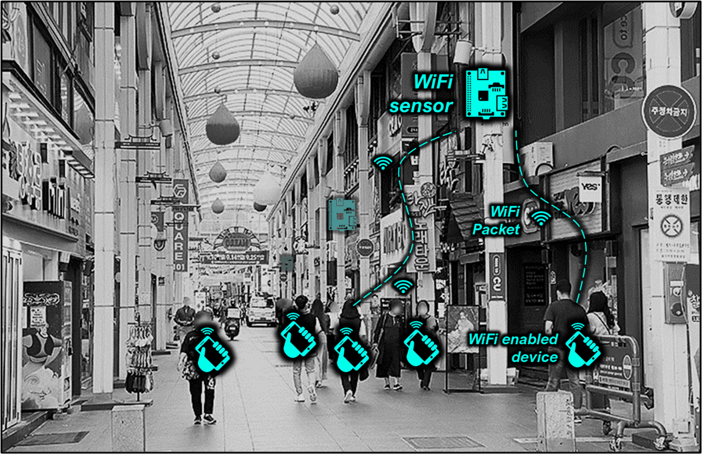
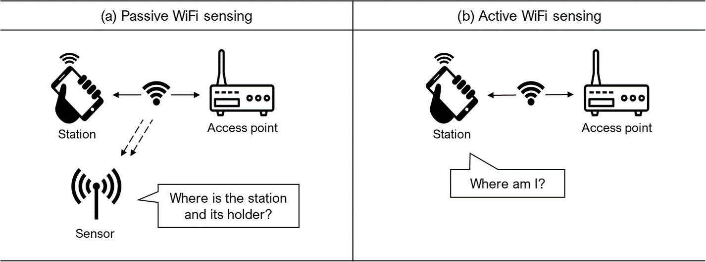

# Introduction {.unnumbered}

This book documents an end-to-end toolkit for building and using WiFi sensors as a proxy for **pedestrian activity** in urban environments. It covers hardware setup, data processing, and five analytical metrics: Location, Count, Track, Revisits, and Activities.

## Why WiFi Sensing?

Quantifying pedestrian traffic is essential for urban planning, public safety, and sustainable city development. Traditional methods such as manual counts and surveys are labor-intensive and provide only snapshots. WiFi sensing can collect repeated observations by receiving selected **IEEE 802.11 frames**, including probe requests that WiFi-enabled devices broadcast to discover nearby networks.

Many pedestrians carry smartphones or other WiFi devices, so retained source-address observations can support location estimation, relative counting, and movement analysis across sensors. A retained identifier is a device-level proxy, not a person count, and modern MAC address randomization constrains every interpretation (@sec-randomization). The collector documented in this book pseudonymizes each source address at capture and never stores the raw address. Passive collection requires no app or active participation from passers-by, which makes large-area observation practical but also creates ethical, legal, and governance obligations (see [When to Use This Toolkit](6-conclusion.qmd)).

Recent urban sensing initiatives, such as the [Array of Things in Chicago](https://arrayofthings.github.io/) and [S-DoT in Seoul](https://github.com/seoul-iotdata/S-DoT_SampleData), demonstrate the growing interest in **sensor-based urban analytics**. This book makes WiFi sensing accessible to researchers, planners, and practitioners using **affordable, off-the-shelf components**.

## Passive vs Active WiFi Sensing

WiFi-based location sensing takes two forms:

**Passive sensing** answers *"Where is the device?"* Sensors (sniffers) receive probe requests broadcast by nearby devices. The device holder doesn't need to do anything: their phone automatically sends these packets. Detection range is typically 30--100 meters outdoors. This book focuses on passive sensing for pedestrian monitoring.

**Active sensing** answers *"Where am I?"* from the device's perspective. The device scans for nearby access points and sends the data to a server for location estimation. This requires user consent and an installed app, making it impractical for monitoring public spaces.

Passive sensing trades **individual-level precision** for **scalability**. It is best suited to aggregate patterns in retained observations, such as when and where activity concentrates and which sensor-to-sensor flows recur. These signals are proxies for pedestrian activity rather than direct measurements of people or intent.

## What This Book Covers

This book follows the full pipeline, from raw hardware to urban insight:

- **Building the Sensor**: assemble a Raspberry Pi sensor, put its WiFi card in monitor mode, and deploy it in the field.
- **Processing Data**: turn the collector's pseudonymized SQLite observations into clean, analysis-ready records.
- **Extracting Metrics**: derive five metrics from the cleaned data (Location, Count, Track, Revisits, and Activities).
- **Demonstration**: apply the pipeline to a commercial district near the University of Ulsan, asking where inferred stays occur and whether the pattern differs between identifiers observed on one qualifying day and those observed on multiple qualifying days.

Three appendices cover practical **deployment notes**, the mechanics and limits of **MAC address randomization**, and a **five-deployment field record** of the randomization transition (2019--2024).

## The Data in This Book

Everything you will analyze comes from one source, presented at three depths:

- **Synthetic fixture**: a fully synthetic capture with no personal data. It drives the processing walkthrough, from [Aggregation](3-1-aggregation.qmd) through [Cleaning](3-2-cleaning.qmd).
- **One-week sample**: one local week filtered from the released campus dataset, about 4.2 million rows. It keeps the metric tutorials light, from [Count](4-3-count.qmd) through [Activities](4-6-activities.qmd).
- **Release datasets**: the full campus (15.0 million rows) and commercial district (5.4 million rows). They back the [case study](5-2-casestudy.qmd) and the accompanying manuscript.

The sample is a pure filter of the release, with the same pseudonyms and schema, so anything observed in a tutorial can be followed into the full data. The release datasets ship with the repository (`data/release-20sec/`) and in the archived deposit cited by the manuscript. The one exception is the GPS validation subset in [Location](4-2-location.qmd), whose identifiers are keyed separately so participant GPS traces cannot be joined to the released data.

## Code and archived data

The code, data, and documentation snapshot (version 1.4.0) is archived at
[Zenodo](https://doi.org/10.5281/zenodo.21442379). Maintained source code is
available in the [GitHub repository](https://github.com/urbanjuhyeon/urban-wifi-sensing-toolkit).
Code and original documentation are licensed under MIT, and the released
datasets under CC BY 4.0.

## References

::: {#refs}
:::

